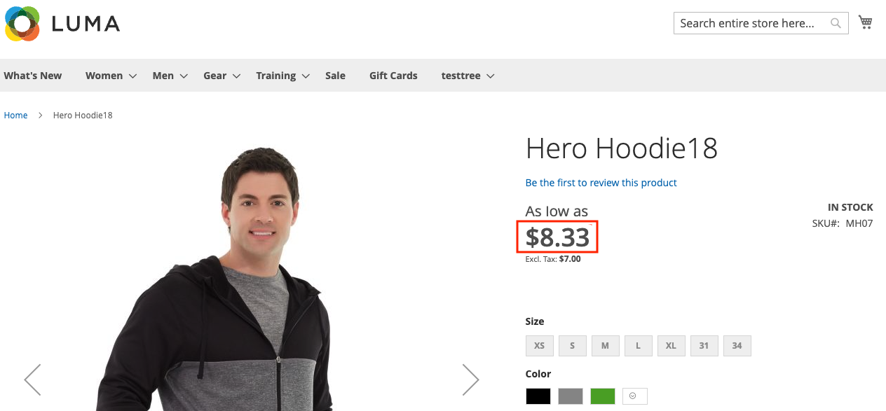

# Adobe Developer App Builder용 API Mesh를 사용하여 세금 요금 표시

[API 메쉬](https://developer.adobe.com/graphql-mesh-gateway/gateway/overview/) 을 사용하면 개발자가 Adobe I/O Runtime을 사용하여 개인 또는 서드파티 API 및 기타 인터페이스를 Adobe 제품과 통합할 수 있습니다.

이 항목에서는 API Mesh를 사용하여 제품 세부 사항 페이지에 세금이 포함된 제품 가격을 표시합니다.

## 세율 설정

제품 세부 사항 페이지에 표시할 세금을 구성해야 합니다.

1. [세율 설정](https://experienceleague.adobe.com/docs/commerce-admin/stores-sales/site-store/taxes/tax-rules.html).
1. 세금이 다음이 되도록 설정 [카탈로그에 표시됨](https://experienceleague.adobe.com/docs/commerce-admin/stores-sales/site-store/taxes/display-settings.html#step-1%3A-configure-catalog-prices-display-settings)를 누르고 다음 중 하나로 설정합니다. `Including and Excluding Tax` 또는 `Including Tax`.

제품 세부 사항 페이지를 확인하여 카탈로그 서비스가 작동하는지 확인하십시오.



## API Mesh 구성

아직 연결되지 않은 경우 카탈로그 서비스가 있는 API Mesh를 인스턴스에 연결합니다. 자세한 지침은 [시작](https://developer.adobe.com/graphql-mesh-gateway/gateway/getting-started/) 항목: API Mesh 개발자 안내서.

다음에서 `mesh.json` 파일, 바꾸기 `name `, `endpoint`, 및 `x-api-key` 값.

```json
{
    "meshConfig": {
      "sources": [
        {
          "name": "<NAME OF MESH>",
          "handler": {
            "graphql": {
              "endpoint": "<COMMERCE INSTANCE GQL ENDPOINT URL>"
            }
          },
          "transforms": [
              {
                  "prefix": {
                      "includeRootOperations": true,
                        "value": "Core_"
                  }
              }
          ]
        },
        {
          "name": "CommerceCatalogServiceGraph",
          "handler": {
            "graphql": {
              "endpoint": "https://catalog-service-sandbox.adobe.io/graphql/",
              "operationHeaders": {
                "Magento-Store-View-Code": "{context.headers['magento-store-view-code']}",
                "Magento-Website-Code": "{context.headers['magento-website-code']}",
                "Magento-Store-Code": "{context.headers['magento-store-code']}",
                "Magento-Environment-Id": "{context.headers['magento-environment-id']}",
                "x-api-key": "API_KEY",
                "Magento-Customer-Group": "{context.headers['magento-customer-group']}"
              },
              "schemaHeaders": {
                "x-api-key": "<YOUR API_KEY>"
              }
            }
          }
        }
      ],
      "additionalTypeDefs": "extend type ComplexProductView {\n  priceWithTaxes: Core_PriceRange\n}\n extend type SimpleProductView {\n  priceWithTaxes: Core_PriceRange\n}\n",
      "additionalResolvers": [
            {  
              "targetTypeName": "ComplexProductView",
              "targetFieldName": "priceWithTaxes",
              "sourceName": "MagentoQACore",
              "sourceTypeName": "Query",
              "sourceFieldName": "Core_products",
              "requiredSelectionSet": "{\n items {\n sku, \n price_range {\n minimum_price {\n final_price {\n value\n currency\n }\n }\n }\n }\n }",
                "sourceArgs": {
                    "filter.sku.eq": "{root.sku}"
                },
                "result": "items[0].price_range"
            },
            {  
              "targetTypeName": "SimpleProductView",
              "targetFieldName": "priceWithTaxes",
              "sourceName": "MagentoQACore",
              "sourceTypeName": "Query",
              "sourceFieldName": "Core_products",
              "requiredSelectionSet": "{\n items {\n sku, \n price_range {\n minimum_price {\n final_price {\n value\n currency\n }\n }\n }\n }\n }",
                "sourceArgs": {
                    "filter.sku.eq": "{root.sku}"
                },
                "result": "items[0].price_range"
            }
        ]
     }
  }
```

이 `mesh.json` 구성 파일:

* Commerce 핵심 응용 프로그램을 해당 쿼리 또는 형식 앞에 &#39;Core_&#39;가 필요하도록 변환합니다. 이렇게 하면 카탈로그 서비스와 이름 지정 충돌이 발생하지 않습니다.
* 를 확장합니다. `ComplexProductView` 및 `SimpleProductView` 라는 새 필드가 있는 형식 `priceWithTaxes`.
* 새 필드에 대한 사용자 지정 해결 프로그램을 추가합니다.

를 사용하여 메쉬를 만듭니다. [create 명령](https://developer.adobe.com/graphql-mesh-gateway/gateway/create-mesh/#create-a-mesh-1) (으)로 `mesh.json` 파일.

### GraphQL 쿼리

새 를 검색할 수 있습니다. `priceWithTaxes` GraphQL을 사용하는 데이터입니다.

쿼리 예:

```graphql
query {
    products(skus:[MH07]) {
        __typename
        id
        sku
        name
        description
        shortDescription
        addToCartAllowed
        url
        ... on ComplexProductView {
            priceWithTaxes {
              minimum_price {
                final_price {
                  value
                }
              }
              maximum_price {
                final_price {
                  value
                }
              }
            }
            priceRange {
                maximum {
                    final {
                        amount {
                            value
                            currency
                        }
                    }
                    regular {
                        amount {
                            value
                            currency
                        }
                    }
                    roles
                }
                minimum {
                    final {
                        amount {
                            value
                            currency
                        }
                    }
                    regular {
                        amount {
                            value
                            currency
                        }
                    }
                    roles
                }
            }
        }
    }
}
```

쿼리 응답:

```json
{
  "data": {
    "products": [
      {
        "__typename": "ComplexProductView",
        "id": "VFVnd053AFpHVm1ZWFZzZEEAWkRWa09Ua3hNVFl0WTJJd015MDBaRGMwTFRnME16a3RNak01TVRVNE9ESTBOemd4AGJXRnBibDkzWldKemFYUmxYM04wYjNKbABZbUZ6WlEAVFVGSE1EQTFPRFEyTVRjeA",
        "sku": "MH07",
        "name": "Hero Hoodie13",
        "description": "<p>Gray and black color blocking sets you apart as the Hero Hoodie keeps you warm on the bus, campus or cold mean streets. Slanted outsize front pockets keep your style real . . . convenient.</p>\r\n<p>* Full-zip gray and black hoodie.<br />* Ribbed hem.<br />* Standard fit.<br />* Drawcord hood cinch.<br />* Water-resistant coating.</p>",
        "shortDescription": "",
        "addToCartAllowed": true,
        "url": "http://commerce_url/hero-hoodie.html",
        "priceWithTaxes": {
          "minimum_price": {
            "final_price": {
              "value": 8.330001
            }
          },
          "maximum_price": {
            "final_price": {
              "value": 13355.524701
            }
          }
        },
        "priceRange": {
          "maximum": {
            "final": {
              "amount": {
                "value": 39.02,
                "currency": "USD"
              }
            },
            "regular": {
              "amount": {
                "value": 54,
                "currency": "USD"
              }
            },
            "roles": [
              "visible"
            ]
          },
          "minimum": {
            "final": {
              "amount": {
                "value": 39.02,
                "currency": "USD"
              }
            },
            "regular": {
              "amount": {
                "value": 54,
                "currency": "USD"
              }
            },
            "roles": [
              "visible"
            ]
          }
        }
      }
    ]
  },
  "extensions": {}
}
```
