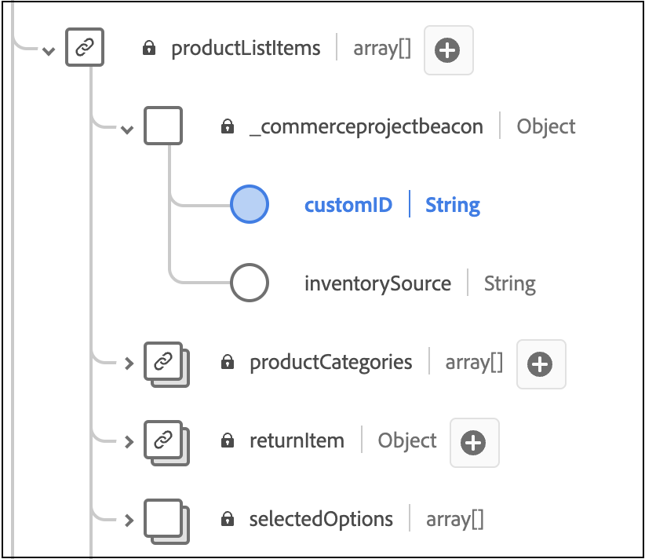

# 사용자 지정 순서 속성 추가

이 문서에서는 백 오피스 이벤트에 사용자 지정 특성을 추가하는 방법에 대해 알아봅니다. 사용자 지정 속성을 사용하면 풍부한 데이터 통찰력을 캡처하여 분석을 향상시키고 나아가 쇼핑객을 위한 개인화된 경험을 만들 수 있습니다.

사용자 지정 속성은 다음 두 가지 수준에서 지원됩니다.

- 주문 수준
- 주문 항목 레벨

>[!NOTE]
>
>Adobe [!DNL Commerce]은(는) 문자열, 부울 또는 날짜 데이터 형식이 있는 사용자 지정 특성을 지원합니다.

백 오피스 이벤트에 사용자 정의 속성을 추가하려면 다음을 수행해야 합니다.

1. [!DNL Commerce] 설치에서 프로젝트를 만듭니다.
1. 새 사용자 지정 특성을 적절하게 Experience Platform에 수집할 수 있도록 스키마를 업데이트합니다.
1. 관리에서 사용자 지정 속성이 캡처되어 Experience Platform으로 전송되는지 확인합니다.

>[!IMPORTANT]
>
>아래 디렉터리 구조 및 코드 샘플은 사용자 지정 특성을 구현하는 방법을 보여 줍니다. 필요한 실제 디렉터리 구조 및 코드는 저장소 구성 및 환경에 따라 다릅니다.

## 1단계: 디렉토리 구조 생성

1. [!DNL Commerce] 설치에서 `app/code` 디렉터리로 이동하여 모듈 디렉터리를 만듭니다. 예: `Magento/AepCustomAttributes`. 이 디렉터리에는 사용자 지정 특성에 필요한 파일이 포함되어 있습니다.
1. 모듈 디렉터리에 `etc`(이)라는 하위 디렉터리를 만듭니다. `etc` 디렉터리에 `module.xml`, `query.xml`, `di.xml` 및 `et_schema.xml` 파일이 있습니다.

## 2단계: 종속성 및 설정 버전 정의

종속성 및 설치 버전을 정의하는 `module.xml` 파일을 만듭니다. For example:

```xml
<?xml version="1.0"?>
<!--
/**
* Copyright (c) [year], [name]. All rights reserved.
*/
-->
<config xmlns:xsi="http://www.w3.org/2001/XMLSchema-instance" xsi:noNamespaceSchemaLocation="urn:magento:framework:Module/etc/module.xsd">
    <module name="Magento_SalesRuleStaging" setup_version="2.0.0">
        <sequence>
            <module name="Magento_Staging"/>
            <module name="Magento_SalesRule"/>
        </sequence>
    </module>
</config>
```

## 3단계: 판매 주문 데이터 검색

판매 주문 데이터를 검색하는 `query.xml` 파일을 만듭니다. For example:

```xml
<query>
    <source name="sales_order" type="sales">
        <attribute name="increment_id" operator="eq" alias="order_increment_id"/>
        <link source="inventory_source_item" condition_type="by_sku"/>
    </source>
</query>
```

## 4단계: 종속성 삽입 설정

종속성 삽입을 설정하는 `di.xml` 파일을 만듭니다. For example:

```xml
<manifest xmlns:android="http://schemas.android.com/apk/res/android"
          package="com.example.instrumentedtest"
          android:versionCode="1"
          android:versionName="1.0">
    <uses-sdk android:minSdkVersion="8" android:targetSdkVersion="15"/>
    
    <instrumentation
        android:name=".MyInstrumentationTestRunner"
        android:targetPackage="com.example.instrumentedtest"/>
    
    <!-- More instrumentation elements might be here -->
</manifest>
```

## 5단계: 종속성 삽입에 사용되는 서비스 정의

종속성 삽입에 사용되는 서비스를 정의하는 `et_schema.xml` 파일을 만듭니다. For example:

```xml
<services>
    <service id="App\Controller\MainController" class="App\Controller\MainController">
        <argument type="service" id="doctrine.orm.default_entity_manager"/>
        <argument type="service" id="form.factory"/>
        <argument type="service" id="security.authorization_checker"/>
    </service>

    <!-- ... -->

    <service id="App\Controller\SecurityController" class="App\Controller\SecurityController">
        <argument type="service" id="security.authentication_utils"/>
        <tag name="controller.service_arguments"/>
    </service>

    <!-- ... -->
</services>
```

## 단계 6: PHP 파일에 대한 디렉토리 만들기

`etc` 디렉터리와 동일한 수준에서 `Module/Provider` 디렉터리를 만듭니다. 이 디렉터리에 `OrderCustomAttributes` 및 `OrderItemCustomAttributes` PHP 파일이 있습니다.

## 7단계: OrderCustomAttributes 정의

사용자 지정 특성 순서를 정의하는 `OrderCustomAttributes.php` 파일을 만듭니다. For example:

```php
namespace App\Transformers;

use League\Fractal\TransformerAbstract;
use Illuminate\Support\Collection;

class CustomAttributeTransformer extends TransformerAbstract
{
    protected $availableIncludes = [];
    protected $defaultIncludes = [];

    public function __construct($signsField, $jsonSignsField = null)
    {
        $this->signsField = $signsField;
        $this->jsonSignsField = $jsonSignsField;
    }

    public function transform(Collection $collection)
    {
        // Initialize array for additional information.
        $additionalInformation = [];

        // Source - this comes from values sent to this transformer.
        foreach ($collection->{$this->signsField} ?: [] as $value) {
            if (is_array($value)) {
                // If value is an array, serialize it.
                foreach ($value as &$item) {
                    if (isset($item['custom_attr'])) {
                        // Serialize custom attribute data.
                        ...
                    }
                }
            } else {
                // Add non-array values directly.
                ...
            }
        }

        ...

        return [
            'current' => ...,
            'additional_information' => ...,
            'source' => ...,
        ];
    }

    private function flatten(array $values)
    {
      return Arr::flatten($values);
  }
}
```

## 8단계: OrderItemCustomAttributes 정의

주문 항목 사용자 지정 특성을 정의하는 `OrderItemCustomAttributes.php` 파일을 만듭니다. For example:

```php
namespace Magento\AepCustomAttributes\Model\Provider;

use Magento\Framework\Serialize\Serializer\Json;

class OrderItemCustomAttribute
{
    private Json $jsonSerializer;
    private string $usingField;

    public function __construct(Json $jsonSerializer, string $usingField)
    {
        $this->jsonSerializer = $jsonSerializer;
        $this->usingField = $usingField;
    }

    public function get(array $values): array
    {
        $output = [];
        $values = $this->flatten($values);

        foreach ($values as $row) {
            $info = \is_string($row['additionalInformation']) ? $row['additionalInformation'] : '{}';
            $unserializedData = $this->jsonSerializer->unserialize($info) ?? [];

            $attrLabel = implode(',', ['label1', 'label2']);
            $unserializedData['custom_attr1'] = $attrLabel;

            $additionalInformation = [];
            foreach ($unserializedData as $name => $value) {
                $additionalInformation[] = [
                    'name' => $name,
                    'value' => \is_string($value) ? $value : $this->jsonSerializer->serialize($value),
                ];
            }

            foreach ($additionalInformation as $information) {
                $output[] = [
                    'additionalInformation' => $information,
                    $this->usingField => $row[$this->usingField],
                ];
            }
        }

        return $output;
    }

    private function flatten(array $values): array
    {
        return array_merge([], ...array_values($values));
    }
}
```

## 9단계: productContext 파일에 대한 디렉터리 만들기

`etc` 디렉터리와 동일한 수준에서 `Plugin/Module` 디렉터리를 만듭니다. 이 디렉터리에 `ProductContext.php` 파일이 있습니다.

## 10단계: ProductContext 클래스 정의

`ProductContext` 클래스를 정의하는 `ProductContext.php`이라는 파일을 만듭니다. For example:

```php
namespace Magento\Catalog\Model\Product;

use Magento\Framework\App\ResourceConnection;
use Magento\Quote\Api\Data\CartInterface;

class ProductContext
{
    private $brandCache = [];
    private $resourceConnection;

    public function __construct(
        ResourceConnection $resourceConnection
    ) {
        $this->resourceConnection = $resourceConnection;
    }

    public function afterGetProductData($subject, array $result)
    {
        if (isset($result['brand_id'])) {
            if (!isset($this->brandCache[$result['brand_id']])) {
                // @todo load brand label by brand id.
                $this->brandCache[$result['brand_id']] = 'Brand Label ' . $result['brand_id'];
            }
            $result['brands'] = ['label' => $this->brandCache[$result['brand_id']]];
        }

        return $result;
    }
}
```

## 11단계: 모듈 등록

`etc` 디렉터리와 동일한 수준에서 모듈을 등록하는 `registration.php` 파일을 만듭니다. For example:

```php
use \Magento\Framework\Component\ComponentRegistrar;

ComponentRegistrar::register(
    ComponentRegistrar::MODULE,
    'Dfe_Stripe',
    __DIR__
);
```

## 12단계: 기존 XDM 스키마 확장

Experience Platform의 [!DNL Commerce] 스키마에서 새 사용자 지정 순서 특성을 수집할 수 있도록 하려면 이러한 사용자 지정 필드를 포함하도록 스키마를 확장해야 합니다.

이러한 사용자 지정 필드를 포함하도록 기존 XDM 스키마를 확장하는 방법에 대해 알아보려면 Experience Platform 설명서의 [UI에서 스키마 만들기 및 편집](https://experienceleague.adobe.com/en/docs/experience-platform/xdm/ui/resources/schemas#custom-fields-for-standard-groups) 문서를 참조하십시오. 테넌트 ID 필드는 동적으로 생성되지만 필드 구조는 Experience Platform 설명서에 제공된 예와 유사해야 합니다.

>[!IMPORTANT]
>
>XDM 사용자 지정 특성은 [!DNL Commerce]에서 보낸 특성과 일치해야 합니다.

`commerce.order`에 주문 수준에 대한 필드를 추가하십시오.


`productListItems`에 주문 항목 수준에 대한 필드를 추가하십시오.



## 12단계: 데이터가 캡처되고 있는지 확인

관리자의 [데이터 사용자 지정](connect-data.md#data-customization) 탭을 보고 사용자 지정 특성 데이터가 캡처되어 Experience Platform에게 전송되고 있는지 확인합니다.

### 문제 해결

**[!UICONTROL Data Customization]** 탭에 `No custom order attributes found.` 메시지가 표시되면 다음을 확인하십시오.

1. [Data Connector 확장](overview.md#prerequisites)을 사용하도록 설정하기 위한 필수 구성 요소를 완료했습니다.
1. [사용자 지정 순서 특성](#add-custom-order-attributes)을 구성했습니다.
1. 하나 이상의 주문 이벤트가 생성되었습니다.
