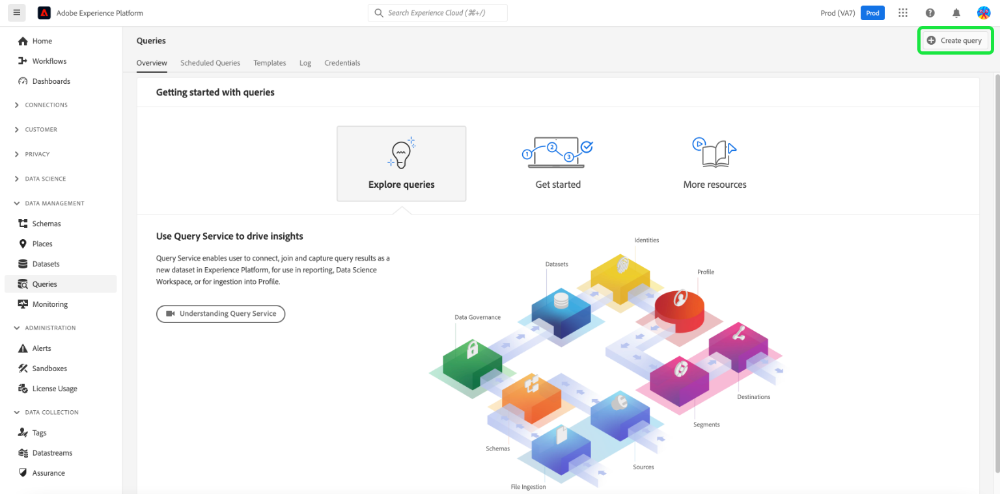

# 상거래 데이터를 Adobe Experience Platform에 연결

Experience Platform 커넥터를 설치하면 **시스템** 아래 메뉴 **서비스** 상거래 내 _관리자_.

- Commerce Services 커넥터
- Experience Platform 커넥터

Adobe Commerce 인스턴스를 Adobe Experience Platform에 연결하려면 Commerce Services 커넥터로 시작한 다음 Experience Platform 커넥터로 마치는 두 커넥터를 모두 구성해야 합니다.

## Commerce Services 커넥터 업데이트

이전에 Adobe Commerce 서비스를 설치한 경우에는 Commerce Services 커넥터를 이미 구성했을 수 있습니다. 그렇지 않으면 다음에 대한 다음 작업을 완료해야 합니다. [상거래 서비스 커넥터](../landing/saas.md) 페이지:

1. 상거래 계정에 로그인 대상 [프로덕션 및 샌드박스 API 키 검색](../landing/saas.md#credentials).
1. 선택 [SaaS 데이터 공간](../landing/saas.md#saas-configuration).
1. Adobe 계정에 로그인 대상 [조직 ID 검색](../landing/saas.md#ims-organization-optional).

Commerce Services 커넥터를 구성한 다음 Experience Platform 커넥터를 구성합니다.

## Experience Platform 커넥터 업데이트

이 섹션에서는 조직 ID를 사용하여 Adobe Commerce 인스턴스를 Adobe Experience Platform에 연결합니다. 그런 다음 Experience Platform 에지로 전송할 데이터 유형(상점 및 백오피스)을 지정할 수 있습니다.


## 일반

1. 관리에서 **시스템** > 서비스 > **Experience Platform 커넥터**.

1. 다음에서 **설정** 아래의 탭 **일반**&#x200B;에서 구성한 대로 Adobe Experience Platform 계정과 연결된 ID를 확인합니다. [Commerce Services 커넥터](../landing/saas.md#organizationid). 조직 ID는 글로벌입니다. Adobe Commerce 인스턴스당 하나의 조직 ID만 연결할 수 있습니다.

1. 다음에서 **범위** 드롭다운에서 컨텍스트를 로 설정합니다. **웹 사이트**.

1. (선택 사항) [AEP 웹 SDK(alloy)](https://experienceleague.adobe.com/docs/experience-platform/edge/home.html) 사이트에 배포된 후 확인란을 활성화하고 AEP 웹 SDK의 이름을 추가합니다. 그렇지 않으면 이러한 필드를 비워 두고 Experience Platform 커넥터가 필드를 배포합니다.

   >[!NOTE]
   >
   >고유한 AEP 웹 SDK를 지정하는 경우 Experience Platform 커넥터는 이 페이지에 지정된 데이터스트림 ID가 아닌 해당 SDK와 연결된 데이터스트림 ID를 사용합니다(있는 경우).

## 데이터 수집

이 섹션에서는 Experience Platform 에지로 전송할 데이터 유형을 지정합니다. 데이터에는 클라이언트측과 서버측, 이렇게 두 가지 유형이 있습니다.

클라이언트측 데이터는 상점 첫 화면에서 캡처한 데이터입니다. 여기에는 다음과 같은 구매자 상호 작용이 포함됩니다. `View Page`, `View Product`, `Add to Cart`, 및 [징발 목록](events.md#b2b-events) 정보(B2B 판매자용). 서버측 데이터 또는 백오피스 데이터는 상거래 서버에 캡처된 데이터입니다. 여기에는 주문이 주문, 취소, 환불, 배송 또는 완료 여부와 같은 주문 상태에 대한 정보가 포함됩니다.

Adobe Commerce 인스턴스가 데이터 수집을 시작할 수 있도록 하려면 다음을 검토하십시오. [전제 조건](overview.md#prerequisites).

자세한 내용은 이벤트 항목을 참조하십시오 [상점 첫 화면](events.md#storefront-events) 및 [후선 근무](events.md#back-office-events) 이벤트.

>[!NOTE]
>
>의 모든 필드 **데이터 수집** 섹션에 섹션 적용 **웹 사이트** 범위 이상.

1. 선택 **Storefront 이벤트** storefront 동작 데이터를 전송하려는 경우.

   >[!NOTE]
   >
   >다음 **Storefront 이벤트** AEP 웹 SDK 및 조직 ID가 유효한 경우 확인란이 자동으로 활성화됩니다.

1. 선택 **백오피스 이벤트** 주문, 취소, 환불 또는 배송 여부 등 주문 상태 정보를 전송하려는 경우.

   >[!NOTE]
   >
   >다음을 선택하는 경우 **백오피스 이벤트**, 모든 백오피스 데이터가 Experience Platform 에지로 전송됩니다. 쇼핑객이 데이터 수집을 옵트아웃하는 경우 Experience Platform에서 쇼핑객의 개인 정보 보호 기본 설정을 명시적으로 설정해야 합니다. 이는 컬렉터가 이미 구매자 환경 설정에 따라 동의를 처리하는 상점 이벤트와는 다릅니다. [자세히 알아보기](https://experienceleague.adobe.com/docs/experience-platform/landing/governance-privacy-security/consent/adobe/dataset.html) Experience Platform에서 쇼핑객의 개인 정보 보호 환경 설정 정보.

1. 에 따라 일정에 따라 백 오피스 이벤트 데이터를 업데이트하려면 [cron](https://experienceleague.adobe.com/docs/commerce-admin/systems/tools/cron.html) 작업, 다음을 변경해야 합니다. `Sales Orders Feed` 색인 대상 `Update by Schedule`.

   1. 다음에서 _관리자_ 사이드바, 이동 **[!UICONTROL System]** > _[!UICONTROL Tools]_>**[!UICONTROL Index Management]**.

   1. 에 대한 확인란을 선택합니다. `Sales Orders Feed` 인덱서.

   1. 설정 **[!UICONTROL Actions]** 끝 `Update by Schedule`.

   1. 백 오피스 데이터를 처음 활성화하는 경우 다음 명령을 실행하여 다시 인덱싱하고 재동기화를 트리거합니다. 다음에 대한 재동기화는 [cron](https://experienceleague.adobe.com/docs/commerce-admin/systems/tools/cron.html) 작업이 올바르게 설정되었습니다.

      ```bash
      bin/magento index:reindex sales_order_data_exporter_v2
      ```

      ```bash
      bin/magento saas:resync --feed orders
      ```

1. (자체 AEP 웹 SDK를 사용하는 경우 이 단계를 건너뜁니다.) [만들기](https://experienceleague.adobe.com/docs/experience-platform/edge/datastreams/configure.html#create) Adobe Experience Platform의 데이터 스트림이나 컬렉션에 사용할 기존 데이터 스트림을 선택합니다.

1. (자체 AEP 웹 SDK를 사용하는 경우 이 단계를 건너뜁니다.) 다음에서 **데이터 스트림 ID** 필드에 새 데이터스트림 또는 기존 데이터스트림의 ID를 붙여넣습니다.

## 필드 설명

| 필드 | 설명 |
|--- |--- |
| 범위 | 구성 설정을 적용할 특정 웹 사이트입니다. |
| 조직 ID (전역) | Adobe DX 제품을 구입한 조직의 ID입니다. 이 ID는 Adobe Commerce 인스턴스를 Adobe Experience Platform에 연결합니다. |
| AEP 웹 SDK가 이미 사이트에 배포되었습니까 | 자신의 AEP 웹 SDK를 사이트에 배포한 경우 이 확인란을 선택합니다 |
| AEP 웹 SDK 이름(전역) | 사이트에 Experience Platform Web SDK가 이미 배포되어 있는 경우 이 필드에 해당 SDK의 이름을 지정합니다. 이렇게 하면 Storefront 이벤트 수집기 및 Storefront 이벤트 SDK가 Experience Platform 커넥터에 의해 배포된 버전이 아니라 Experience Platform Web SDK를 사용할 수 있습니다. 사이트에 Experience Platform Web SDK가 배포되어 있지 않은 경우 이 필드를 비워 두고 Experience Platform 커넥터에서 배포합니다. |
| Storefront 이벤트 | 조직 ID 및 데이터 스트림 ID가 유효한 경우 기본적으로 선택되어 있습니다. Storefront 이벤트는 사이트를 탐색할 때 쇼핑객으로부터 익명으로 처리된 행동 데이터를 수집합니다. |
| 백오피스 이벤트 | 선택하면 이벤트 페이로드에 주문이 주문, 취소, 환불 또는 배송된 경우와 같이 익명으로 처리된 주문 상태 정보가 포함됩니다. |
| 데이터 스트림 ID(웹 사이트) | Adobe Experience Platform에서 다른 Adobe DX 제품으로 데이터가 흐를 수 있는 ID입니다. 이 ID는 특정 Adobe Commerce 인스턴스 내의 특정 웹 사이트에 연결되어야 합니다. 고유한 Experience Platform Web SDK를 지정하는 경우 이 필드에 데이터 스트림 ID를 지정하지 마십시오. Experience Platform 커넥터는 해당 SDK와 연결된 데이터 스트림 ID를 사용하며 이 필드에 지정된 데이터 스트림 ID는 무시합니다(있는 경우). |

>[!NOTE]
>
>온보딩 후 상점 데이터가 Experience Platform 에지로 흐르기 시작합니다. 백오피스 데이터가 가장자리에 표시되는 데 약 5분이 소요됩니다. cron 일정에 따라 에지에서 후속 업데이트가 표시됩니다.

## (Beta) 이전 주문 데이터 보내기

>[!NOTE]
>
>이 기능은 Beta 사용자만 사용할 수 있습니다. 다음 주소로 이메일을 보내 Beta에 가입할 수 있습니다. `dataconnection@adobe.com`.

Adobe Commerce은 최대 5년간의 과거 주문 데이터와 상태를 수집합니다. Experience Platform 커넥터를 사용하여 이전 데이터를 Experience Platform으로 전송하여 그러한 이전 주문을 기반으로 고객 프로필을 보강할 수 있습니다. 데이터는 Experience Platform 내의 데이터 세트에 저장됩니다.

Commerce에서 이미 이전 주문 데이터를 수집하는 동안 해당 데이터를 Experience Platform으로 보내려면 몇 가지 작업을 완료해야 합니다. 다음 섹션은 이러한 과정을 안내합니다.

### 이전 주문 베타 설치

Beta에 대한 이전 주문 데이터 수집을 활성화하려면 프로젝트의 루트를 업데이트해야 합니다 [!DNL Composer] `.json` 파일을 다음과 같이 지정합니다.

1. 루트 열기 `composer.json` 파일 및 검색 `magento/experience-platform-connector`.

1. 다음에서 `require` 섹션에서 버전 번호를 다음과 같이 업데이트합니다.

   ```json
   "require": {
      ...
      "magento/experience-platform-connector": "^3.0.0-beta1",
      ...
    }
   ```

1. B2B 가맹점의 경우 `.json` 파일을 다음과 같이 지정합니다.

   ```json
   "require": {
     ...
     "magento/experience-platform-connector-b2b": "^2.0.0-beta1"
     ...
   }
   ```

1. **저장** `composer.json`. 그런 다음 명령줄에서 다음을 실행합니다.

   ```bash
   composer update magento/experience-platform-connector –-with-dependencies
   ```

   또는 B2B 판매자의 경우:

   ```bash
   composer update magento/experience-platform-connector-b2b --with-dependencies
   ```

### 이전 주문 Beta 구성

고객 주문 내역을 Experience Platform에 전송하려면 상거래 인스턴스를 Experience Platform에 연결하는 자격 증명을 지정해야 합니다. 을(를) 이미 설치하고 활성화한 경우 [Audience Activation](https://experienceleague.adobe.com/docs/commerce-admin/customers/audience-activation.html) 확장에서 필요한 자격 증명을 이미 지정했으므로 이 단계를 건너뛸 수 있습니다. Audience Activation 확장을 아직 설치하고 활성화하지 않은 경우 다음 단계를 완료하십시오.

>[!NOTE]
>
>이 섹션에서는 개발자 콘솔에서 자격 증명을 입력합니다. 개발자 콘솔 프로젝트에 올바른 항목이 있는지 확인합니다. [역할 및 권한 구성됨](https://experienceleague.adobe.com/docs/experience-platform/landing/platform-apis/api-authentication.html#assign-api-to-a-role).

1. 다음에서 _관리자_ 사이드바, 이동 **[!UICONTROL Stores]** > _[!UICONTROL Settings]_>**[!UICONTROL Configuration]**.

1. 확장 **[!UICONTROL Services]** 및 선택 **[!UICONTROL Experience Platform Connector]**.

1. 에 있는 구성 자격 증명을 입력하십시오. [개발자 콘솔](https://developer.adobe.com/console/home).

   {width="700" zoomable="yes"}

   >[!NOTE]
   >
   >Beta의 경우 Commerce는 개발자 콘솔에서 JSON 웹 토큰(JWT) 자격 증명을 사용합니다. 베타 이후 Commerce는 개발자 콘솔에서 OAuth 2.0을 사용합니다.

1. 클릭 **구성 저장**.

### 주문 동기화 서비스 설정

개발자 자격 증명을 입력한 후 주문 동기화 서비스를 설정할 수 있습니다. 동기화 서비스 주문은 [메시지 큐 프레임워크](https://developer.adobe.com/commerce/php/development/components/message-queues/) 그리고 RabbitMQ. 이러한 단계를 완료하면 주문 상태 데이터가 SaaS에 동기화될 수 있습니다. SaaS는 Experience Platform으로 전송되기 전에 필요합니다.

1. [사용](https://experienceleague.adobe.com/docs/commerce-cloud-service/user-guide/configure/service/rabbitmq.html) RabbitMQ.

   >[!NOTE]
   >
   >RabbitMQ이 Commerce 버전 2.4.7 이상에 대해 이미 설정되었지만 소비자를 활성화해야 합니다.

1. 의 cron job별로 메시지 대기열 소비자 활성화 `.magento.env.yaml` 사용 `CRON_CONSUMERS_RUNNER` 환경 변수입니다.

   ```yaml
      stage:
        deploy:
          CRON_CONSUMERS_RUNNER:
            cron_run: true
   ```

   >[!NOTE]
   >
   >다음을 참조하십시오. [변수 배포 설명서](https://experienceleague.adobe.com/docs/commerce-cloud-service/user-guide/configure/env/stage/variables-deploy.html#cron_consumers_runner) 사용 가능한 모든 구성 옵션에 대해 알아봅니다.

주문 동기화 서비스를 활성화한 상태에서 Experience Platform 커넥터 페이지에서 내역 주문 날짜 범위를 지정할 수 있습니다.

### 주문 내역 날짜 범위 지정

이 섹션에서는 Experience Platform으로 전송할 내역 주문에 대한 날짜 범위를 지정합니다.

{width="700" zoomable="yes"}

1. 관리에서 **시스템** > 서비스 > **Experience Platform 커넥터**.

1. 다음 항목 선택 **주문 내역** 탭.

1. 아래 **주문 내역 동기화**&#x200B;을(를) 입력한 후 **데이터 세트 ID**. 에서 지정한 데이터 스트림과 연결된 동일한 데이터 세트여야 합니다. [데이터 수집](#data-collection) 위의 섹션.

   1. 데이터 세트 ID에 액세스하려면 Experience Platform UI를 열고 를 선택합니다. **데이터 세트** 을(를) 왼쪽 탐색에서 열어 **데이터 세트** 대시보드입니다. 대시보드에는 조직에서 사용 가능한 모든 데이터 세트가 나열됩니다. 이름, 데이터 세트가 준수하는 스키마, 가장 최근 수집 실행 상태 등 나열된 각 데이터 세트에 대한 세부 사항이 표시됩니다.
   1. 데이터 스트림과 연결된 데이터 세트를 엽니다.
   1. 오른쪽 창에는 데이터 세트에 대한 세부 사항이 표시됩니다. 데이터 세트 ID를 복사합니다.

   {width="700" zoomable="yes"}

1. 다음에서 **출처:** 및 **종료** 필드는 전송할 내역 주문 데이터의 데이터 범위를 지정합니다. 5년을 초과하는 날짜 범위는 선택할 수 없습니다.

1. 선택 [!UICONTROL Start Sync] 동기화를 시작하도록 트리거합니다. 이전 주문 데이터는 스트리밍 데이터인 상점 및 백오피스 데이터가 아닌 일괄 처리된 데이터입니다. 일괄 처리된 데이터가 Experience Platform에 도착하는 데 약 45분이 소요됩니다.

   >[!NOTE]
   >
   >Beta의 경우 동일하거나 중복되는 시간 범위에서 동기화를 여러 번 트리거하면 데이터 세트에 중복 이벤트가 표시됩니다.

## 이벤트 데이터 수집 확인

상거래 저장소에서 데이터가 수집되고 있는지 확인하려면 [Adobe Experience Platform 디버거](https://experienceleague.adobe.com/docs/experience-platform/debugger/home.html) 상거래 사이트를 검사합니다. 데이터가 수집되고 있는지 확인한 후, 의 데이터를 반환하는 쿼리를 실행하여 상점 및 백 오피스 이벤트 데이터가 에지에 표시되는지 확인할 수 있습니다. [생성한 데이터 세트](overview.md#prerequisites).

1. 선택 **쿼리** Experience Platform의 왼쪽 탐색에서 [!UICONTROL Create Query].

   

1. 쿼리 편집기가 열리면 데이터 세트에서 데이터를 선택하는 쿼리를 입력합니다.

   

   예를 들어 쿼리는 다음과 같을 수 있습니다.

   ```sql
   SELECT * from `your_dataset_name` ORDER by TIMESTAMP DESC
   ```

1. 쿼리가 실행되면 결과는 **결과** 탭, 다음 옆에 있음 **콘솔** 탭. 이 보기는 쿼리의 테이블 형식 출력을 보여 줍니다.

   

이 예제에서는에서 이벤트 데이터가 표시됩니다. [`commerce.productListAdds`](events.md#addtocart), [`commerce.productViews`](events.md#productpageview), [`web.webpagedetails.pageViews`](events.md#pageview)등. 이 보기를 통해 상거래 데이터가 에지에 도달했는지 확인할 수 있습니다.

결과가 예상과 다른 경우 데이터 세트를 열고 실패한 일괄 처리 가져오기를 찾습니다. 자세히 알아보기 [일괄 가져오기 문제 해결](https://experienceleague.adobe.com/docs/experience-platform/ingestion/batch/troubleshooting.html).
