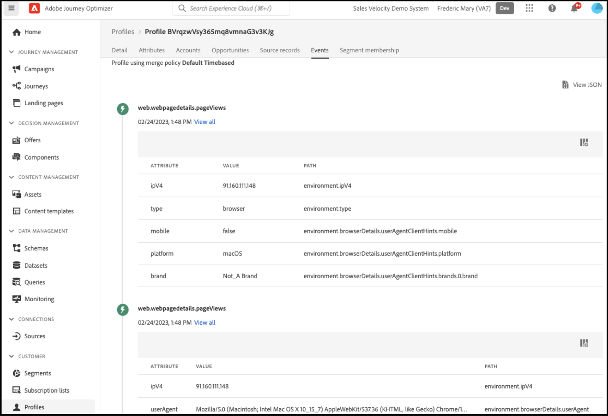

# Adobe Journey Optimizer을 사용하여 포기한 장바구니 이메일 보내기

[Adobe Journey Optimizer](https://experienceleague.adobe.com/docs/journey-optimizer/using/get-started/get-started.html) 은 쇼핑객을 위해 상거래 경험을 개인화할 수 있도록 지원합니다. 예를 들어, Journey Optimizer을 사용하여 소매 스토어에 대한 주별 판촉 행사 등 예약된 마케팅 캠페인을 만들고 게재하거나, 고객이 장바구니에 제품을 추가했지만 체크아웃 프로세스를 완료하지 않은 경우 포기한 장바구니 이메일을 생성할 수 있습니다.

다음 단계를 따라 다음 단계를 수행하는 방법을 배울 수 있습니다. `checkout` 상거래 인스턴스에서 생성된 이벤트를 수신하고 Journey Optimizer의 해당 이벤트에 응답하여 포기한 장바구니 이메일을 작성합니다.

>[!IMPORTANT]
>
>데모 목적으로 Commerce 샌드박스 환경을 사용하고 있는지 확인하십시오. 이렇게 하면 Experience Platform으로 전송하는 상점 및 백오피스 이벤트 데이터가 프로덕션 이벤트 데이터를 희석하지 않습니다.

## 전제 조건

이 단계를 시작하기 전에 다음을 확인하십시오.

- Adobe Journey Optimizer을 사용할 수 있도록 프로비저닝되었습니다.
- 본인 [구성됨](connect-data.md) Experience Platform 커넥터
- 본인 [확인됨](connect-data.md#confirm-that-event-data-is-collected) 상거래 이벤트 데이터가 Experience Platform 에지에 도달합니다.

## 1단계: Commerce 샌드박스 환경에서 사용자 만들기

샌드박스 환경에서 사용자를 만들고 사용자 계정 정보가 Experience Platform에 표시되는지 확인합니다. 지정한 이메일이 이 섹션의 뒷부분에서 포기한 장바구니 이메일을 보내는 데 사용된 이메일과 같이 유효한지 확인합니다.

1. Commerce 샌드박스 환경에서 로그인하거나 계정을 만듭니다.

   {width="700" zoomable="yes"}

   Experience Platform 커넥터를 설치 및 구성한 상태에서 이 계정 정보는 프로필로 Experience Platform에게 전송됩니다.

1. 사용자 계정 정보가 **[!UICONTROL Profile]** Experience Platform 섹션에 있는 마지막 항목이 될 필요가 없습니다.

   다음으로 이동 **[!UICONTROL Profiles]** Adobe Experience Platform. 클릭 **[!UICONTROL Detail]** 을 클릭하여 만든 프로필을 확인합니다.

   {width="700" zoomable="yes"}

## 2단계: Journey Optimizer에서 이벤트 보기

Commerce 샌드박스 환경에서 제품 페이지를 보고, 장바구니에 항목을 추가하고, 쇼퍼가 수행할 다양한 작업을 수행합니다. 이러한 활동은 상점에서 이벤트를 트리거합니다. 이제 이러한 이벤트가 Journey Optimizer으로 흘러가고 있음을 확인할 수 있습니다.

1. 시작 [Adobe Journey Optimizer](https://experienceleague.adobe.com/docs/journey-optimizer/using/get-started/user-interface.html).
1. 선택 **[!UICONTROL Profiles]**.
1. 설정 **[!UICONTROL Identity namespace]** 끝 `Email`.
1. 설정 **[!UICONTROL Identity value]** 이메일 주소로 보냅니다.
1. 프로필을 선택한 다음 **[!UICONTROL Events]** 탭.

   {width="700" zoomable="yes"}

   다음 항목을 찾습니다. `commerce.checkouts` 이벤트 및 이벤트 페이로드를 검사합니다.

   ```json
   "personID": "84281643067178465783746543501073369488", 
   "eventType": "commerce.checkouts", 
   "_id": "4b41703f-e42e-485b-8d63-7001e3580856-0", 
   "commerce": { 
       "cart": {}, 
       "checkouts": { 
           "value": 1 
       } 
   ```

   알 수 있듯이 전체 이벤트 페이로드에는 풍부한 이벤트 데이터가 포함되어 있습니다. 다음 섹션에서는 를 수신하고 응답하도록 Journey Optimizer에서 이벤트를 구성합니다. `commerce.checkouts` 상거래 상점 첫 화면에서 이벤트가 생성되었습니다.

## 3단계: Journey Optimizer에서 이벤트 구성

Journey Optimizer에서 두 개의 이벤트를 구성합니다. 한 개의 이벤트는 `commerce.checkouts` commerce의 이벤트이고, 다른 하나는 포기한 장바구니 이메일을 트리거하기 전에 특정 시간이 경과할 때까지 기다리는 기본 시간 초과 이벤트입니다.

### 리스너 이벤트 만들기

1. 시작 [Adobe Journey Optimizer](https://experienceleague.adobe.com/docs/journey-optimizer/using/get-started/user-interface.html).

1. 클릭 **[!UICONTROL Configurations]** 다음 아래에 **[!UICONTROL Administration]** 왼쪽 창의 섹션입니다.

1. 다음에서 **[!UICONTROL Events]** 타일, 클릭 **[!UICONTROL Manage]**.

   {width="700" zoomable="yes"}

1. 다음에서 **[!UICONTROL Events]** 페이지, 클릭 **[!UICONTROL Create Event]**.

1. 오른쪽 탐색에서 다음과 같이 이벤트를 설정합니다.

   1. 설정 **[!UICONTROL Name]** 끝: `firstname_lastname_checkout`.
   1. 설정 **[!UICONTROL Type]** 끝 **[!UICONTROL Unitary]**.
   1. 설정 **[!UICONTROL Event id typ]e** 끝 **[!UICONTROL Rule based]**.
   1. 설정 **[!UICONTROL Schema]** (으)로 [스키마](update-xdm.md).
   1. 선택 **[!UICONTROL Fields]** 및 **[!UICONTROL Fields]** 표시되는 페이지에서 이 이벤트에 유용한 필드를 선택합니다.

      예를 들어 **[!UICONTROL Product list items]**, **[!UICONTROL Commerce]**, **[!UICONTROL eventType]**, 및 **[!UICONTROL Web]**.

   1. 클릭 **[!UICONTROL OK]** 을 눌러 선택한 필드를 저장합니다.
   1. 의 내부를 클릭합니다. **[!UICONTROL Event id condition]** 필드 및 조건 만들기 `eventType` 다음과 같음 `commerce.checkouts` 및 `personalEmail.address` 은 이전 섹션에서 프로필을 만들 때 사용한 이메일 주소와 같습니다.

      {width="700" zoomable="yes"}

   1. 클릭 **[!UICONTROL OK]**.
   1. 클릭 **[!UICONTROL Save]** 이벤트를 저장합니다.

### 시간 초과 이벤트 만들기

1. 이전과 마찬가지로 Journey Optimizer에서 이벤트를 만듭니다.

1. 오른쪽 탐색에서 다음과 같이 이벤트를 설정합니다.

   1. 설정 **[!UICONTROL Name]** 끝: `firstname_lastname_timeout`.
   1. 설정 **[!UICONTROL Type]** 끝 **[!UICONTROL Unitary]**.
   1. 설정 **[!UICONTROL Event id typ]e** 끝 **[!UICONTROL Rule based]**.
   1. 설정 **[!UICONTROL Schema]** (으)로 [스키마](update-xdm.md).
   1. 설정 **[!UICONTROL Schema]**, **[!UICONTROL Fields]**, 및 **[!UICONTROL Event id condition]** 을 위의 과 동일하게 설정합니다.
   1. 클릭 **[!UICONTROL Save]** 이벤트를 저장합니다.

이 두 이벤트를 구성하여 포기한 장바구니 이메일을 보내는 여정을 만듭니다.

## 4단계: 체크아웃 여정 작성

를 수신하는 여정 만들기 `commerce.checkouts` 지정된 시간이 경과하면 중단된 장바구니 이메일을 전송합니다.

1. Journey Optimizer에서 **[!UICONTROL Journeys]** 아래에 **J[!UICONTROL OURNEY MANAGEMENT]**.
1. 클릭 **[!UICONTROL Create Journey]**.
1. 여정 이름을 지정합니다.
1. 클릭 **[!UICONTROL OK]** 여정을 저장합니다.
1. 왼쪽 탐색( 아래) **[!UICONTROL EVENTS]** 섹션에서 이전에 만든 체크아웃 이벤트를 검색합니다. `firstname_lastname_checkout` 캔버스에 끌어서 놓으세요.

   >[!TIP]
   >
   >이벤트를 두 번 클릭하면 캔버스에 자동으로 추가됩니다.

1. 시간 초과 이벤트를 검색하고 캔버스에 추가합니다.
1. 시간 초과 이벤트를 두 번 클릭합니다.

   1. 다음에서 **[!UICONTROL Timeout]** 섹션에서 **[!UICONTROL Define the event time]** 확인란.
   1. 다음에서 **[!UICONTROL Wait for]** 필드 입력 `1` 및 `Minute`.
   1. 다음 항목 선택 **[!UICONTROL Set a timeout path]** 확인란.

   이 시간 초과 구성을 사용하면 체크아웃을 수행하지만 1분 이내에 주문을 완료하지 않는 쇼퍼가 이 시간 초과 분기를 트리거합니다. 실제 프로덕션 환경에서는 이 값을 24시간과 같이 더 긴 기간 동안 설정합니다.

1. 아래의 왼쪽 탐색에서 **[!UICONTROL ACTIONS]**, 추가 **[!UICONTROL Email]** 작업을 시간 초과 분기에 추가합니다. 여정은 다음과 같아야 합니다.

   {width="700" zoomable="yes"}

### 포기한 장바구니 이메일 만들기

포기한 장바구니가 감지될 때 전송되는 포기한 장바구니 이메일을 만듭니다.

1. 위에서 만든 여정에서 **[!UICONTROL Email]** 아이콘으로 표시됩니다.

1. 다음 [단계](https://experienceleague.adobe.com/docs/journey-optimizer/using/content-management/personalization/personalization-use-cases/personalization-use-case-helper-functions.html#configure-email) 포기한 장바구니 이메일을 만들려면 Journey Optimizer 안내서를 참조하십시오.

여정 이제 Journey Optimizer에서 `commerce.checkouts` 상거래 스토어의 이벤트 및 일정 시간이 지난 후 전송된 포기한 장바구니 이메일입니다. 다음 섹션에서 여정을 테스트합니다.

## 5단계: 실시간으로 체크아웃 이벤트 트리거

이 섹션에서는 이벤트를 실시간으로 테스트합니다.

1. Journey Optimizer에서 테스트 모드를 전환합니다.

   {width="700" zoomable="yes"}

1. 이 여정을 실시간으로 테스트하려면 다른 브라우저 탭을 열고 샌드박스 상거래 웹 사이트로 이동합니다.

   1. 장바구니에 제품을 추가합니다.
   1. 체크아웃 페이지로 이동합니다.
   1. 체크아웃 페이지에서 기본 페이지로 돌아가거나 탭을 닫아 장바구니를 포기합니다.

      이제 여정이 트리거됩니다. 확인하려면 Journey Optimizer에서 여정이 있는 탭을 엽니다. 사용자가 이동한 경로를 표시하는 녹색 화살표가 표시됩니다.

1. 받은 편지함에서 이메일을 확인합니다.
