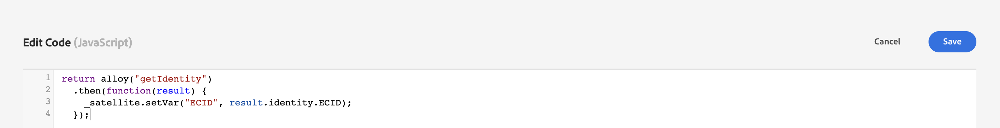
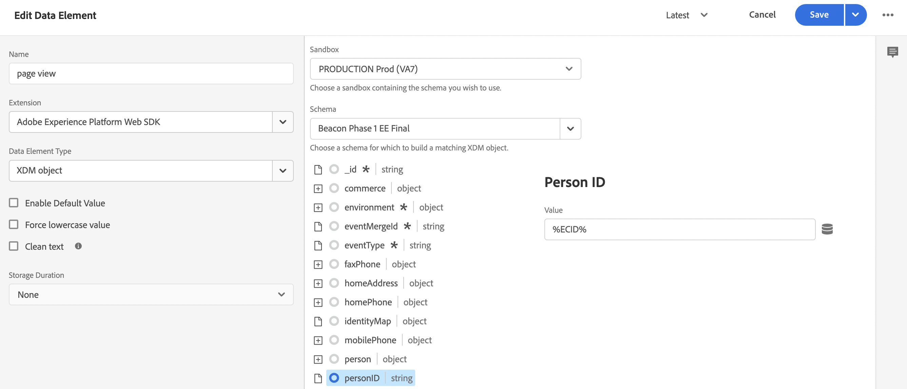

# Adobe Experience Platform 태그를 사용하여 상거래 데이터 수집

Experience Platform 커넥터를 사용하여 상점 이벤트를 게시하고 구독할 수 있지만, 일부 가맹점은 이미 과 같은 데이터 수집 솔루션을 사용하고 있을 수 있습니다 [Adobe Experience Platform 태그](https://experienceleague.adobe.com/docs/platform-learn/data-collection/tags/create-a-property.html?lang=en). 이러한 판매자의 경우 Adobe Commerce에서는 Adobe Commerce 이벤트 SDK를 사용하는 Experience Platform 커넥터에서 게시 전용 옵션을 제공합니다.


_태그를 사용한 Experience Platform 커넥터 데이터 흐름_

이 항목에서는 Experience Platform 커넥터에서 제공한 상점 이벤트 값을 이미 사용 중인 Adobe Experience Platform 태그 솔루션에 매핑하는 방법을 알아봅니다.

## Adobe Commerce에서 이벤트 데이터 수집

상거래 이벤트 데이터를 수집하려면

- 설치 [Adobe Commerce 이벤트 SDK](https://github.com/adobe/commerce-events/tree/main/packages/commerce-events-sdk). PHP 저장 영역의 경우 [설치](install.md) 주제. PWA Studio 스토어에 대해서는 [PWA Studio 안내서](https://developer.adobe.com/commerce/pwa-studio/integrations/adobe-commerce/aep/).

   >[!NOTE]
   >
   > 작업 **not** [구성](connect-data.md) 조직 ID 및 데이터 스트림 ID입니다.

## Adobe Experience Platform에 상거래 상점 전면 데이터 매핑

Commerce storefront 데이터를 Adobe Experience Platform에 매핑하려면 Adobe Experience Platform 태그 내에서 다음을 구성 및 설치합니다.

1. [태그 속성 설정](https://experienceleague.adobe.com/docs/platform-learn/implement-in-websites/configure-tags/create-a-property.html?lang=en) ( Adobe Experience Platform 데이터 수집).

1. 아래 **작성**, 선택 **확장** 다음 확장을 설치하고 구성합니다.

   - [Adobe 클라이언트 데이터 레이어](https://experienceleague.adobe.com/docs/experience-platform/tags/extensions/adobe/client-data-layer/overview.html)

   - [Adobe Experience Platform Web SDK](https://experienceleague.adobe.com/docs/experience-platform/edge/fundamentals/installing-the-sdk.html)

1. [태그 게시](https://experienceleague.adobe.com/docs/experience-platform/tags/publish/overview.html) 개발 환경에 연결할 수 있습니다.

1. 다음을 수행합니다 **이벤트 매핑** 아래 단계에서 특정 이벤트에 대한 데이터 요소와 규칙을 구성합니다.

### 이벤트 매핑

태그를 사용하는 데이터 수집은 Adobe Commerce 이벤트 SDK를 사용하는 것과 다르므로 두 프레임워크에서 사용되는 것과 동일한 용어를 이해하는 것이 중요합니다.

| Adobe Experience Platform 태그 용어 | Adobe Commerce 이벤트 SDK 용어 |
|---|---|
| _데이터 요소_ | 컨텍스트 |
| _규칙_ | 이벤트 |
|  | _규칙 조건_ - 이벤트 리스너(ACDL에서)<br><br>_규칙 작업_ - 이벤트 처리기(Adobe Experience Platform에 보내기) |

Adobe Experience Platform 태그의 데이터 요소와 규칙을 Adobe Commerce 관련 이벤트 데이터로 업데이트할 때 몇 가지 일반적인 단계를 수행해야 합니다.

예를 들어 Adobe Commerce을 추가하겠습니다 `signOut` 이벤트를 Adobe Experience Platform 태그로 보냅니다. 설정한 특정 값을 제외하고 아래에 설명된 단계는 추가 방법을 설명합니다 [데이터 요소](https://experienceleague.adobe.com/docs/experience-platform/collection/e2e.html#data-element) 및 [규칙](https://experienceleague.adobe.com/docs/experience-platform/collection/e2e.html#create-a-rule): 태그에 추가할 모든 Adobe Commerce 이벤트에 적용됩니다.

1. 데이터 요소 만들기:

   
   _새 데이터 요소 만들기_

1. 설정 **이름** to `sign out`.

1. 설정 **확장** to `Adobe Experience Platform Web SDK`.

1. 설정 **데이터 요소 유형** to `XDM object`.

1. 을(를) 선택합니다 **샌드박스** 및 **스키마** 업데이트하려는 업데이트입니다.

1. 아래 **userAccount** > **로그아웃**, 설정 **value** in **방문자 로그아웃** to `1`.

   
   _로그아웃 값 업데이트_

1. 선택 **저장**.

1. 규칙 만들기:

   
   _새 규칙 만들기_

1. 선택 **추가** 아래에 **이벤트**.

1. 설정 **확장** to `Adobe Client Data Layer`.

1. 설정 **이벤트 유형** to `Data Pushed`.

1. 선택 **특정 이벤트** 그리고 **등록할 이벤트/키** to `sign-out`.

1. 선택 **변경 내용 유지** 새 규칙을 저장하려면 을 클릭합니다.

1. 작업을 추가합니다.

1. 설정 **확장** to `Adobe Experience Platform Web SDK`.

1. 설정 **작업 유형** to `Send Event`.

1. 설정 **인스턴스** to `Alloy`.

1. 설정 **유형** to `userAccount.logout`.

1. 설정 **XDM 데이터** to `%sign out%`.

1. 클릭 **저장**.

   스키마에 `signOut` 이벤트는 Adobe Commerce에서 가져옵니다. 또한 Adobe Commerce 스토어프런트에서 해당 이벤트를 실행할 때 발생해야 하는 특정 작업이 있는 규칙을 만들었습니다.

아래 설명된 각 Adobe Commerce 이벤트에 대해 태그에서 위의 단계를 반복합니다.

## 사용 가능한 이벤트

다음 각 이벤트에 대해 위의 단계에 따라 Adobe Commerce 이벤트를 XDM에 매핑합니다.

- [&#39;signOut&#39;](#signout)
- [&#39;signIn&#39;](#signin)
- [&#39;createAccount&#39;](#createaccount)
- [&#39;editAccount&#39;](#editaccount)
- [&#39;pageView&#39;](#pageview)
- [&#39;productView&#39;](#productview)
- [&#39;searchRequestSent&#39;](#searchrequestsent)
- [&#39;searchResponseReceived&#39;](#searchresponsereceived)
- [&#39;addToCart&#39;](#addtocart)
- [&#39;openCart&#39;](#opencart)
- [&#39;viewCart&#39;](#viewcart)
- [&#39;removeFromCart&#39;](#removefromcart)
- [&#39;initiateCheckout&#39;](#initiatecheckout)
- [&#39;placeOrder&#39;](#placeorder)

### signOut {#signout}

쇼핑객이 로그아웃하려 할 때 트리거됩니다.

#### 데이터 요소

다음 데이터 요소를 만듭니다.

1. 로그아웃:

   - **이름**: `Sign out`
   - **확장**: `Adobe Experience Platform Web SDK`
   - **데이터 요소 유형**: `XDM object`
   - **필드 그룹**: `userAccount` > `logout`
   - **방문자 로그아웃**: **값** = `1`

#### 규칙 

- **이름**: `Sign out`
- **확장**: `Adobe Client Data Layer`
- **이벤트 유형**: `Data Pushed`
- **특정 이벤트**: `sign-out`

##### 작업

- **확장**: `Adobe Experience Platform Web SDK`
- **작업 유형**: `Send event`
- **유형**: `userAccount.logout`
- **XDM 데이터**: `%sign-out%`

### signIn {#signin}

쇼핑객이 로그인하려고 할 때 트리거됩니다.

#### 데이터 요소

다음 데이터 요소를 만듭니다.

1. 계정 전자 메일:

   - **이름**: `account email`
   - **확장**: `Adobe Client Data Layer`
   - **데이터 요소 유형**: `Data Layer Computed State`
   - **[선택 사항입니다] 경로**: `accountContext.emailAddress`

1. 계정 유형:

   - **이름**: `account type`
   - **확장**: `Adobe Client Data Layer`
   - **데이터 요소 유형**: `Data Layer Computed State`
   - **[선택 사항입니다] 경로**: `accountContext.accountType`

1. 계정 ID:

   - **이름**: `account id`
   - **확장**: `Adobe Client Data Layer`
   - **데이터 요소 유형**: `Data Layer Computed State`
   - **[선택 사항입니다] 경로***: `accountContext.accountId`

1. 로그인:

   - **이름**: `sign in`
   - **확장**: `Adobe Experience Platform Web SDK`
   - **데이터 요소 유형**: `XDM object`
   - **필드 그룹**: `person` > `accountID`
   - **계정 ID**: **값** = `%account id%`
   - **필드 그룹**: `person` > `accountType`
   - **계정 유형**: **값** = `%account type%`
   - **필드 그룹**: `person` > `personalEmailID`
   - **개인 이메일 주소**: **값** = `%account email%`
   - **필드 그룹**: `personalEmail` > `address`
   - **주소**: **값** = `%account email%`
   - **필드 그룹**: `userAccount` > `login`
   - **방문자 로그인**: **값** = `1`

#### 규칙 

- **이름**: `sign in`
- **확장**: `Adobe Client Data Layer`
- **이벤트 유형**: `Data Pushed`
- **특정 이벤트**: `sign-in`

##### 작업

- **확장**: `Adobe Experience Platform Web SDK`
- **작업 유형**: `Send event`
- **유형**: `userAccount.login`
- **XDM 데이터**: `%sign in%`

### createAccount {#createaccount}

쇼핑객이 계정을 만들려고 할 때 트리거됩니다.

#### 데이터 요소

다음 데이터 요소를 만듭니다.

1. 계정 전자 메일:

   - **이름**: `account email`
   - **확장**: `Adobe Client Data Layer`
   - **데이터 요소 유형**: `Data Layer Computed State`
   - **[선택 사항입니다] 경로**: `accountContext.emailAddress`

1. 계정 유형:

   - **이름**: `account type`
   - **확장**: `Adobe Client Data Layer`
   - **데이터 요소 유형**: `Data Layer Computed State`
   - **[선택 사항입니다] 경로**: `accountContext.accountType`

1. 계정 ID:

   - **이름**: `account id`
   - **확장**: `Adobe Client Data Layer`
   - **데이터 요소 유형**: `Data Layer Computed State`
   - **[선택 사항입니다] 경로**: `accountContext.accountId`

1. 계정 만들기:

   - **이름**: `Create account`
   - **확장**: `Adobe Experience Platform Web SDK`
   - **데이터 요소 유형**: `XDM object`
   - **필드 그룹**: `person` > `accountID`
   - **계정 ID**: **값** = `%account id%`
   - **필드 그룹**: `person` > `accountType`
   - **계정 유형**: **값** = `%account type%`
   - **필드 그룹**: `person` > `personalEmailID`
   - **개인 이메일 주소**: **값** = `%account email%`
   - **필드 그룹**: `personalEmail` > `address`
   - **주소**: **값** = `%account email%`
   - **필드 그룹**: `userAccount` > `createProfile`
   - **계정 프로필 만들기**: **값** = `1`

#### 규칙 

- **이름**: `Create account`
- **확장**: `Adobe Client Data Layer`
- **이벤트 유형**: `Data Pushed`
- **특정 이벤트**: `create-account`

##### 작업

- **확장**: `Adobe Experience Platform Web SDK`
- **작업 유형**: `Send event`
- **유형**: `userAccount.createProfile`
- **XDM 데이터**: `%create account%`

### editAccount {#editaccount}

쇼핑객이 계정을 편집하려고 할 때 트리거됩니다.

#### 데이터 요소

다음 데이터 요소를 만듭니다.

1. 계정 전자 메일:

   - **이름**: `account email`
   - **확장**: `Adobe Client Data Layer`
   - **데이터 요소 유형**: `Data Layer Computed State`
   - **[선택 사항입니다] 경로**: `accountContext.emailAddress`

1. 계정 유형:

   - **이름**: `account type`
   - **확장**: `Adobe Client Data Layer`
   - **데이터 요소 유형**: `Data Layer Computed State`
   - **[선택 사항입니다] 경로**: `accountContext.accountType`

1. 계정 ID:

   - **이름**: `account id`
   - **확장**: `Adobe Client Data Layer`
   - **데이터 요소 유형**: `Data Layer Computed State`
   - **[선택 사항입니다] 경로**: `accountContext.accountId`

1. 계정 편집:

   - **이름**: `Edit account`
   - **확장**: `Adobe Experience Platform Web SDK`
   - **데이터 요소 유형**: `XDM object`
   - **필드 그룹**: `person` > `accountID`
   - **계정 ID**: **값** = `%account id%`
   - **필드 그룹**: `person` > `accountType`
   - **계정 유형**: **값** = `%account type%`
   - **필드 그룹**: `person` > `personalEmailID`
   - **개인 이메일 주소**: **값** = `%account email%`
   - **필드 그룹**: `personalEmail` > `address`
   - **주소**: **값** = `%account email%`
   - **필드 그룹**: `userAccount` > `updateProfile`
   - **계정 프로필 만들기**: **값** = `1`

#### 규칙

- **이름**: `Edit account`
- **확장**: `Adobe Client Data Layer`
- **이벤트 유형**: `Data Pushed`
- **특정 이벤트**: `edit-account`

##### 작업

- **확장**: `Adobe Experience Platform Web SDK`
- **작업 유형**: `Send event`
- **유형**: `userAccount.updateProfile`
- **XDM 데이터**: `%edit account%`

### pageView {#pageview}

페이지가 로드될 때 트리거됩니다.

#### 데이터 요소

다음 데이터 요소를 만듭니다.

1. 페이지 이름:

   - **이름**: `page name`
   - **확장**: `Adobe Client Data Layer`
   - **데이터 요소 유형**: `Data Layer Computed State`
   - **[선택 사항입니다] 경로**: `pageContext.pageName`

#### 규칙 

- **이름**: `page view`
- **확장**: `Adobe Client Data Layer`
- **이벤트 유형**: `Data Pushed`
- **특정 이벤트**: `page-view`

##### 작업

- **확장**: `Adobe Experience Platform Web SDK`
- **작업 유형**: `Send event`
- **유형**: `web.webPageDetails.pageViews`
- **XDM 데이터**: `%page view%`

### productView {#productview}

제품 페이지가 로드될 때 트리거됩니다.

#### 데이터 요소

다음 데이터 요소를 만듭니다.

1. 제품 이름:

   - **이름**: `product name`
   - **확장**: `Adobe Client Data Layer`
   - **데이터 요소 유형**: `Data Layer Computed State`
   - **[선택 사항입니다] 경로**: `productContext.name`

1. 제품 SKU:

   - **이름**: `product sku`
   - **확장**: `Adobe Client Data Layer`
   - **데이터 요소 유형**: `Data Layer Computed State`
   - **[선택 사항입니다] 경로**: `productContext.sku`

1. 제품 이미지 URL:

   - **이름**: `product image`
   - **확장**: `Adobe Client Data Layer`
   - **데이터 요소 유형**: `Data Layer Computed State`
   - **[선택 사항입니다] 경로**: `productContext.mainImageUrl`

1. 제품 통화:

   - **이름**: `product currency`
   - **확장**: `Adobe Client Data Layer`
   - **데이터 요소 유형**: `Data Layer Computed State`
   - **[선택 사항입니다] 경로**: `productContext.pricing.currencyCode`

1. 통화 코드:

   - **이름**: `currency code`
   - **확장**: `Core`
   - **데이터 요소 유형**: `Custom Code`
   - **편집기 열기**:

   ```bash
   return _satellite.getVar('product currency') || _satellite.getVar('storefront').storeViewCurrencyCode
   ```

1. 특별 가격:

   - **이름**: `special price`
   - **확장**: `Adobe Client Data Layer`
   - **데이터 요소 유형**: `Data Layer Computed State`
   - **[선택 사항입니다] 경로**: `productContext.pricing.specialPrice`

1. 정가:

   - **이름**: `regular price`
   - **확장**: `Adobe Client Data Layer`
   - **데이터 요소 유형**: `Data Layer Computed State`
   - **[선택 사항입니다] 경로**: `productContext.pricing.regularPrice`

1. 제품 가격:

   - **이름**: `product price`
   - **확장**: `Core`
   - **데이터 요소 유형**: `Custom Code`
   - **편집기 열기**:

   ```bash
   return _satellite.getVar('product regular price') || _satellite.getVar('product special price')
   ```

1. 제품 보기:

   - **이름**: `product view`
   - **확장**: `Adobe Experience Platform Web SDK`
   - **데이터 요소 유형**: `XDM object`
   - **필드 그룹**: `productListItems`. 선택 **개별 항목 제공** 을 클릭하고 **항목 추가** 버튼을 클릭합니다. 이 보기는 PDP용이므로 단일 항목으로 채울 수 있습니다.
   - **필드 그룹**: `productListItems` > `name`
   - **이름**: **값** = `%product name%`
   - **필드 그룹**: `productListItems` > `SKU`
   - **SKU**: **값** = `%product sku%`
   - **필드 그룹**: `productListItems` > `priceTotal`
   - **가격 합계**: **값** = `%product price%`
   - **필드 그룹**: `productListItems` > `currencyCode`
   - **통화 코드**: **값** = `%currency code%`
   - **필드 그룹**: `productListItems` > `ProductImageUrl`
   - **ProductImageUrl**: **값** = `%product image%`
   - **필드 그룹**: `commerce` > `productViews` > `value`
   - **value**: **값** = `1`

#### 규칙 

- **이름**: `product view`
- **확장**: `Adobe Client Data Layer`
- **이벤트 유형**: `Data Pushed`
- **특정 이벤트**: `product-page-view`

##### 작업

- **확장**: `Adobe Experience Platform Web SDK`
- **작업 유형**: `Send event`
- **유형**: `commerce.productViews`
- **XDM 데이터**: `%product view%`

### searchRequestSent {#searchrequestsent}

&quot;입력할 때 검색&quot; 팝오버와 검색 결과 페이지의 이벤트에 의해 트리거됩니다.

#### 데이터 요소

다음 데이터 요소를 만듭니다.

1. 검색 입력

   - **이름**: `search input`
   - **확장**: `Adobe Client Data Layer`
   - **데이터 요소 유형**: `Data Layer Computed State`
   - **[선택 사항입니다] 경로**: `searchInputContext.units[0]`

1. 검색 입력 구

   - **이름**: `search input phrase`
   - **확장**: `Core`
   - **데이터 요소 유형**: `Custom Code`
   - **편집기 열기**:

   ```bash
   return _satellite.getVar('search input').phrase;
   ```

1. 검색 입력 정렬

   - **이름**: `search input sort`
   - **확장**: `Core`
   - **데이터 요소 유형**: `Custom Code`
   - **편집기 열기**:

   ```bash
   const searchInput = _satellite.getVar('search input');
   const sortFromInput = searchInput ? searchInput.sort : [];
   const sort = sortFromInput.map((searchSort) => {
       return {
           attribute: searchSort.attribute,
           order: searchSort.direction,
       };
   });
   return sort;
   ```

1. 입력 필터 검색

   - **이름**: `search input filters`
   - **확장**: `Core`
   - **데이터 요소 유형**: `Custom Code`
   - **편집기 열기**:

   ```bash
   const searchInput = _satellite.getVar('search input');
   const filtersFromInput = searchInput ? searchInput.filter : [];
   const filters = filtersFromInput.map(
       (searchFilter) => {
           let value = [];
           let isRange = false;
           if (searchFilter.eq) {
               value.push(searchFilter.eq);
           } else if (searchFilter.in) {
               value = searchFilter.in;
           } else if (searchFilter.range) {
               isRange = true;
               value.push(String(searchFilter.range.from));
               value.push(String(searchFilter.range.to));
           }
           return {
               attribute: searchFilter.attribute,
               value,
               isRange,
           };
       }
   );
   
   return filters;
   ```

1. 검색 요청:

   - **이름**: `search request`
   - **확장**: `Adobe Experience Platform Web SDK`
   - **데이터 요소 유형**: `XDM object`
   - **필드 그룹**: `siteSearch` > `phrase`
   - **value**: 아직 사용할 수 없음
   - **필드 그룹**: `siteSearch` > `sort`. 선택 **전체 개체 제공**.
   - **필드 그룹**: `siteSearch` > `filter`. 선택 **전체 개체 제공**.
   - **필드 그룹**: `searchRequest` > `value`
   - **value**: **값** = `1`

#### 규칙 

- **이름**: `search request sent`
- **확장**: `Adobe Client Data Layer`
- **이벤트 유형**: `Data Pushed`
- **특정 이벤트**: `search-request-sent`

##### 작업

- **확장**: `Adobe Experience Platform Web SDK`
- **작업 유형**: `Send event`
- **유형**: `searchRequest`
- **XDM 데이터**: `%search request%`

### searchResponseReceived {#searchresponsereceived}

Live Search가 &quot;입력한 대로 검색&quot; 팝업 또는 검색 결과 페이지에 대한 결과를 반환하는 경우 트리거됩니다.

#### 데이터 요소

다음 데이터 요소를 만듭니다.

1. 검색 결과:

   - **이름**: `search results`
   - **확장**: `Adobe Client Data Layer`
   - **데이터 요소 유형**: `Data Layer Computed State`
   - **[선택 사항입니다] 경로**: `searchResultsContext.units[0]`

1. 제품 검색 결과 수:

   - **이름**: `search result number of products`
   - **확장**: `Core`
   - **데이터 요소 유형**: `Custom Code`
   - **편집기 열기**:

   ```bash
   return _satellite.getVar('search result').products.length;
   ```

1. 검색 결과 제품:

   - **이름**: `search result products`
   - **확장**: `Core`
   - **데이터 요소 유형**: `Custom Code`
   - **편집기 열기**:

   ```bash
   const searchResult = _satellite.getVar('search result');
   const productsFromResult = searchResult.products ? searchResult.products : [];
   const products = productsFromResult.map(
       (product) => {
           return { SKU: product.sku, name: product.name };
       }
   );
   return products;
   ```

1. 검색 결과 제안:

   - **이름**: `search result products`
   - **확장**: `Core`
   - **데이터 요소 유형**: `Custom Code`
   - **편집기 열기**:

   ```bash
   const searchResult = _satellite.getVar('search result');
   const suggestionsFromResult = searchResult.suggestions ? searchResult.suggestions : [];
   const suggestions = suggestionsFromResult.map((suggestion) => suggestion.suggestion);
   return suggestions;
   ```

1. 제품 이미지 URL:

   - **이름**: `product image`
   - **확장**: `Adobe Client Data Layer`
   - **데이터 요소 유형**: `Data Layer Computed State`
   - **[선택 사항입니다] 경로**: `productContext.mainImageUrl`

1. 검색 응답:

   - **이름**: `search response`
   - **확장**: `Adobe Experience Platform Web SDK`
   - **데이터 요소 유형**: `XDM object`
   - **필드 그룹**: `siteSearch` > `suggestions`. 선택 **전체 개체 제공**.
   - **데이터 요소**: `%search result suggestions%`
   - **필드 그룹**: `siteSearch` > `numberOfResults`
   - **value**: `%search result number of products%`
   - **필드 그룹**: `productListItems`. 선택 **전체 개체 제공**.
   - **필드 그룹**: `productListItems` > `ProductImageUrl`
   - **ProductImageUrl**: **값** = `%product image%`
   - **데이터 요소**: `%search result products%`
   - **필드 그룹**: `searchResponse` > `value`
   - **value**: **값** = `1`

#### 규칙 

- **이름**: `search response received`
- **확장**: `Adobe Client Data Layer`
- **이벤트 유형**: `Data Pushed`
- **특정 이벤트**: `search-response-received`

##### 작업

- **확장**: `Adobe Experience Platform Web SDK`
- **작업 유형**: `Send event`
- **유형**: `searchResponse`
- **XDM 데이터**: `%search response%`

### addToCart {#addtocart}

장바구니에 제품을 추가할 때 또는 장바구니의 제품 수량이 늘어날 때마다 트리거됩니다.

#### 데이터 요소

다음 데이터 요소를 만듭니다.

1. 제품 이름:

   - **이름**: `product name`
   - **확장**: `Adobe Client Data Layer`
   - **데이터 요소 유형**: `Data Layer Computed State`
   - **[선택 사항입니다] 경로**: `productContext.name`

1. 제품 sku:

   - **이름**: `product sku`
   - **확장**: `Adobe Client Data Layer`
   - **데이터 요소 유형**: `Data Layer Computed State`
   - **[선택 사항입니다] 경로**: `productContext.sku`

1. 통화 코드:

   - **이름**: `currency code`
   - **확장**: `Adobe Client Data Layer`
   - **데이터 요소 유형**: `Data Layer Computed State`
   - **[선택 사항입니다] 경로**: `productContext.pricing.currencyCode`

1. 제품 특별 가격:

   - **이름**: `product special price`
   - **확장**: `Adobe Client Data Layer`
   - **데이터 요소 유형**: `Data Layer Computed State`
   - **[선택 사항입니다] 경로**: `productContext.pricing.specialPrice`

1. 제품 이미지 URL:

   - **이름**: `product image`
   - **확장**: `Adobe Client Data Layer`
   - **데이터 요소 유형**: `Data Layer Computed State`
   - **[선택 사항입니다] 경로**: `productContext.mainImageUrl`

1. 제품 정가:

   - **이름**: `product regular price`
   - **확장**: `Adobe Client Data Layer`
   - **데이터 요소 유형**: `Data Layer Computed State`
   - **[선택 사항입니다] 경로**: `productContext.pricing.regularPrice`

1. 제품 가격:

   - **이름**: `product price`
   - **확장**: `Core`
   - **데이터 요소 유형**: `Custom Code`
   - **편집기 열기**:

   ```bash
   return _satellite.getVar('product regular price') || _satellite.getVar('product special price') 
   ```

1. 장바구니:

   - **이름**: `cart`
   - **확장**: `Adobe Client Data Layer`
   - **데이터 요소 유형**: `Data Layer Computed State`
   - **[선택 사항입니다] 경로**: `shoppingCartContext`

1. 장바구니 ID:

   - **이름**: `cart id`
   - **확장**: `Core`
   - **데이터 요소 유형**: `Custom Code`
   - **편집기 열기**:

   ```bash
   return _satellite.getVar('cart').id
   ```

1. 장바구니에 추가:

   - **이름**: `add to cart`
   - **확장**: `Adobe Experience Platform Web SDK`
   - **데이터 요소 유형**: `XDM object`
   - **필드 그룹**: `productListItems`. 선택 **개별 항목 제공** 을 클릭하고 **항목 추가** 버튼을 클릭합니다. 이 보기는 PDP용이므로 단일 항목으로 채울 수 있습니다.
   - **필드 그룹**: `productListItems` > `name`
   - **이름**: **값** = `%product name%`
   - **필드 그룹**: `productListItems` > `SKU`
   - **SKU**: **값** = `%product sku%`
   - **필드 그룹**: `productListItems` > `priceTotal`
   - **가격 합계**: **값** = `%product price%`
   - **필드 그룹**: `productListItems` > `currencyCode`
   - **필드 그룹**: `productListItems` > `ProductImageUrl`
   - **ProductImageUrl**: **값** = `%product image%`
   - **통화 코드**: **값** = `%currency code%`
   - **필드 그룹**: `commerce` > `cart` > `cartID`
   - **장바구니 ID**: **값** = `%cart id%`
   - **필드 그룹**: `commerce` > `productListAdds` > `value`
   - **value**: **값** = `1`

#### 규칙 

- **이름**: `add to cart`
- **확장**: `Adobe Client Data Layer`
- **이벤트 유형**: `Data Pushed`
- **특정 이벤트**: `add-to-cart`

##### 작업

- **확장**: `Adobe Experience Platform Web SDK`
- **작업 유형**: `Send event`
- **유형**: `commerce.productListAdds`
- **XDM 데이터**: `%add to cart%`

### openCart {#opencart}

새 장바구니가 생성될 때 트리거되며, 제품이 빈 장바구니에 추가될 때 발생합니다.

#### 데이터 요소

다음 데이터 요소를 만듭니다.

1. 장바구니 열기:

   - **이름**: `open cart`
   - **확장**: `Adobe Experience Platform Web SDK`
   - **데이터 요소 유형**: `XDM object`
   - **필드 그룹**: `commerce` > `productListOpens` > `value`
   - **value**: **값** = `1`
   - **필드 그룹**: `commerce` > `cart` > `cartID`
   - **장바구니 ID**: **값** = `%cart id%`
   - **필드 그룹**: `productListItems`. 대상 `productListItems`여러 항목을 미리 계산할 수 있습니다. 선택 **productListItems** > **전체 스토리지 제공**.

#### 규칙 

- **이름**: `open cart`
- **확장**: `Adobe Client Data Layer`
- **이벤트 유형**: `Data Pushed`
- **특정 이벤트**: `open-cart`

##### 작업

- **확장**: `Adobe Experience Platform Web SDK`
- **작업 유형**: `Send event`
- **유형**: `commerce.productListOpens`
- **XDM 데이터**: `%open cart%`

### viewCart {#viewcart}

장바구니 페이지가 로드될 때 트리거됩니다.

#### 데이터 요소

다음 데이터 요소를 만듭니다.

1. 상점:

   - **이름**: `storefront`
   - **확장**: `Adobe Client Data Layer`
   - **데이터 요소 유형**: `Data Layer Computed State`
   - **[선택 사항입니다] 경로**: `storefrontInstanceContext`

1. 제품 이미지 URL:

   - **이름**: `product image`
   - **확장**: `Adobe Client Data Layer`
   - **데이터 요소 유형**: `Data Layer Computed State`
   - **[선택 사항입니다] 경로**: `productContext.mainImageUrl`
   1. 장바구니:
   - **이름**: `cart`
   - **확장**: `Adobe Client Data Layer`
   - **데이터 요소 유형**: `Data Layer Computed State`
   - **[선택 사항입니다] 경로**: `shoppingCartContext`


1. 장바구니 ID:

   - **이름**: `cart id`
   - **확장**: `Core`
   - **데이터 요소 유형**: `Custom Code`
   - **편집기 열기**:

   ```bash
   return _satellite.getVar('cart').id
   ```

1. 제품 목록 항목:

   - **이름**: `product list items:`
   - **확장**: `Core`
   - **데이터 요소 유형**: `Custom Code`
   - **편집기 열기**:

   ```bash
   const storefrontContext = _satellite.getVar('storefront');
   const cart = _satellite.getVar('cart');
   
   const returnList = [];
   cart.items.forEach(item => {
       const selectedOptions = [];
       item.configurableOptions?.forEach(option => {
           selectedOptions.push({
               attribute: option.optionLabel,
               value: option.valueLabel,
           });
       });
   
       const productListItem = {
           SKU: item.product.sku,
           name: item.product.name,
           quantity: item.quantity,
           priceTotal: item.prices.price.value * item.quantity,
           currencyCode: item.prices.price.currency ? item.prices.price.currency : storefrontContext.storeViewCurrencyCode,
           selectedOptions: selectedOptions,
       };
   
       returnList.push(productListItem);
   });
   return returnList;
   ```

1. 장바구니 보기:

   - **이름**: `view cart`
   - **확장**: `Adobe Experience Platform Web SDK`
   - **데이터 요소 유형**: `XDM object`
   - **필드 그룹**: `productListItems`. 대상 `productListItems`를 채울 때 여러 항목이 있을 수 있습니다. 선택 **productListItems** > **전체 어레이 채우기**.
   - **데이터 요소**: `%product list items%`
   - **필드 그룹**: `productListItems` > `ProductImageUrl`
   - **ProductImageUrl**: **값** = `%product image%`
   - **필드 그룹**: `commerce` > `cart` > `cartID`
   - **장바구니 ID**: **값** = `%cart id%`
   - **필드 그룹**: `commerce` > `productListViews` > `value`
   - **value**: **값** = `1`

#### 규칙

- **이름**: `view cart`
- **확장**: `Adobe Client Data Layer`
- **이벤트 유형**: `Data Pushed`
- **특정 이벤트**: `shopping-cart-view`

##### 작업

- **확장**: `Adobe Experience Platform Web SDK`
- **작업 유형**: `Send event`
- **유형**: `commerce.productListViews`
- **XDM 데이터**: `%view cart%`

### removeFromCart {#removefromcart}

장바구니에서 제품이 제거되거나 장바구니에 있는 제품의 수량이 감소될 때마다 트리거됩니다.

#### 데이터 요소

다음 데이터 요소를 만듭니다.

1. 제품 이름:

   - **이름**: `product name`
   - **확장**: `Adobe Client Data Layer`
   - **데이터 요소 유형**: `Data Layer Computed State`
   - **[선택 사항입니다] 경로**: `productContext.name`

1. 제품 sku:

   - **이름**: `product sku`
   - **확장**: `Adobe Client Data Layer`
   - **데이터 요소 유형**: `Data Layer Computed State`
   - **[선택 사항입니다] 경로**: `productContext.sku`

1. 통화 코드:

   - **이름**: `currency code`
   - **확장**: `Adobe Client Data Layer`
   - **데이터 요소 유형**: `Data Layer Computed State`
   - **[선택 사항입니다] 경로**: `productContext.pricing.currencyCode`

1. 제품 특별 가격:

   - **이름**: `product special price`
   - **확장**: `Adobe Client Data Layer`
   - **데이터 요소 유형**: `Data Layer Computed State`
   - **[선택 사항입니다] 경로**: `productContext.pricing.specialPrice`

1. 제품 정가:

   - **이름**: `product regular price`
   - **확장**: `Adobe Client Data Layer`
   - **데이터 요소 유형**: `Data Layer Computed State`
   - **[선택 사항입니다] 경로**: `productContext.pricing.regularPrice`

1. 제품 가격:

   - **이름**: `product price`
   - **확장**: `Core`
   - **데이터 요소 유형**: `Custom Code`
   - **편집기 열기**:

   ```bash
   return _satellite.getVar('product regular price') || _satellite.getVar('product special price') 
   ```

1. 장바구니:

   - **이름**: `cart`
   - **확장**: `Adobe Client Data Layer`
   - **데이터 요소 유형**: `Data Layer Computed State`
   - **[선택 사항입니다] 경로**: `shoppingCartContext`

1. 장바구니 ID:

   - **이름**: `cart id`
   - **확장**: `Core`
   - **데이터 요소 유형**: `Custom Code`
   - **편집기 열기**:

   ```bash
   return _satellite.getVar('cart').id
   ```

1. 장바구니에서 제거:

   - **이름**: `remove from cart`
   - **확장**: `Adobe Experience Platform Web SDK`
   - **데이터 요소 유형**: `XDM object`
   - **필드 그룹**: `productListItems`. 선택 **개별 항목 제공** 을 클릭하고 **항목 추가** 버튼을 클릭합니다. 이 보기는 PDP용이므로 단일 항목으로 채울 수 있습니다.
   - **필드 그룹**: `productListItems` > `name`
   - **이름**: **값** = `%product name%`
   - **필드 그룹**: `productListItems` > `SKU`
   - **SKU**: **값** = `%product sku%`
   - **필드 그룹**: `productListItems` > `priceTotal`
   - **가격 합계**: **값** = `%product price%`
   - **필드 그룹**: `productListItems` > `currencyCode`
   - **통화 코드**: **값** = `%currency code%`
   - **필드 그룹**: `commerce` > `cart` > `cartID`
   - **장바구니 ID**: **값** = `%cart id%`
   - **필드 그룹**: `commerce` > `productListRemovals` > `value`
   - **value**: **값** = `1`

#### 규칙 

- **이름**: `remove from cart`
- **확장**: `Adobe Client Data Layer`
- **이벤트 유형**: `Data Pushed`
- **특정 이벤트**: `remove-from-cart`

##### 작업

- **확장**: `Adobe Experience Platform Web SDK`
- **작업 유형**: `Send event`
- **유형**: `commerce.productListRemovals`
- **XDM 데이터**: `%remove from cart%`

### initiateCheckout {#initiatecheckout}

쇼핑객이 체크아웃 단추를 클릭할 때 트리거됩니다.

#### 데이터 요소

다음 데이터 요소를 만듭니다.

1. 상점:

   - **이름**: `storefront`
   - **확장**: `Adobe Client Data Layer`
   - **데이터 요소 유형**: `Data Layer Computed State`
   - **[선택 사항입니다] 경로**: `storefrontInstanceContext`

1. 제품 이미지 URL:

   - **이름**: `product image`
   - **확장**: `Adobe Client Data Layer`
   - **데이터 요소 유형**: `Data Layer Computed State`
   - **[선택 사항입니다] 경로**: `productContext.mainImageUrl`

1. 장바구니:

   - **이름**: `cart`
   - **확장**: `Adobe Client Data Layer`
   - **데이터 요소 유형**: `Data Layer Computed State`
   - **[선택 사항입니다] 경로**: `shoppingCartContext`

1. 장바구니 ID:

   - **이름**: `cart id`
   - **확장**: `Core`
   - **데이터 요소 유형**: `Custom Code`
   - **편집기 열기**:

   ```bash
   return _satellite.getVar('cart').id
   ```

1. 제품 목록 항목:

   - **이름**: `product list items`
   - **확장**: `Core`
   - **데이터 요소 유형**: `Custom Code`
   - **편집기 열기**:

   ```bash
   const storefrontContext = _satellite.getVar('storefront');
   const cart = _satellite.getVar('cart');
   
   const returnList = [];
   cart.items.forEach(item => {
       const selectedOptions = [];
       item.configurableOptions?.forEach(option => {
           selectedOptions.push({
               attribute: option.optionLabel,
               value: option.valueLabel,
           });
       });
   
       const productListItem = {
           SKU: item.product.sku,
           name: item.product.name,
           quantity: item.quantity,
           priceTotal: item.prices.price.value * item.quantity,
           currencyCode: item.prices.price.currency ? item.prices.price.currency : storefrontContext.storeViewCurrencyCode,
           selectedOptions: selectedOptions,
       };
   
       returnList.push(productListItem);
   });
   return returnList;
   ```

1. 체크 아웃 시작:

   - **이름**: `initiate checkout`
   - **확장**: `Adobe Experience Platform Web SDK`
   - **데이터 요소 유형**: `XDM object`
   - **필드 그룹**: `productListItems`. 대상 `productListItems`를 채울 때 여러 항목이 있을 수 있습니다. 선택 **productListItems** > **전체 어레이 채우기**.
   - **데이터 요소**: `%product list items%`
   - **필드 그룹**: `productListItems` > `ProductImageUrl`
   - **ProductImageUrl**: **값** = `%product image%`
   - **필드 그룹**: `commerce` > `cart` > `cartID`
   - **장바구니 ID**: **값** = `%cart id%`
   - **필드 그룹**: `commerce` > `checkouts` > `value`
   - **value**: **값** = `1`

#### 규칙 

- **이름**: `initiate checkout`
- **확장**: `Adobe Client Data Layer`
- **이벤트 유형**: `Data Pushed`
- **특정 이벤트**: `initiate-checkout`

##### 작업

- **확장**: `Adobe Experience Platform Web SDK`
- **작업 유형**: `Send event`
- **유형**: `commerce.checkouts`
- **XDM 데이터**: `%initiate checkout%`

### placeOrder {#placeorder}

쇼핑객이 주문을 할 때 트리거됩니다.

#### 데이터 요소

다음 데이터 요소를 만듭니다.

1. 상점:

   - **이름**: `storefront`
   - **확장**: `Adobe Client Data Layer`
   - **데이터 요소 유형**: `Data Layer Computed State`
   - **[선택 사항입니다] 경로**: `storefrontInstanceContext`

1. 제품 이미지 URL:

   - **이름**: `product image`
   - **확장**: `Adobe Client Data Layer`
   - **데이터 요소 유형**: `Data Layer Computed State`
   - **[선택 사항입니다] 경로**: `productContext.mainImageUrl`

1. 장바구니:

   - **이름**: `cart`
   - **확장**: `Adobe Client Data Layer`
   - **데이터 요소 유형**: `Data Layer Computed State`
   - **[선택 사항입니다] 경로**: `shoppingCartContext`

1. 장바구니 ID:

   - **이름**: `cart id`
   - **확장**: `Core`
   - **데이터 요소 유형**: `Custom Code`
   - **편집기 열기**:

   ```bash
   return _satellite.getVar('cart').id
   ```

1. 순서:

   - **이름**: `order`
   - **확장**: `Adobe Client Data Layer`
   - **데이터 요소 유형**: `Data Layer Computed State`
   - **[선택 사항입니다] 경로**: `orderContext`

1. 상거래 순서:

   - **이름**: `commerce order`
   - **확장**: `Core`
   - **데이터 요소 유형**: `Custom Code`
   - **편집기 열기**:

   ```bash
   const order = _satellite.getVar('order');
   const storefront = _satellite.getVar('storefront');
   
   if (order.payments && order.payments.length) {
       payments = order.payments.map(payment => {
           return {
               paymentAmount: payment.total,
               paymentType: payment.paymentMethodCode,
               transactionID: order.orderId.toString(),
           };
       });
   } else {
       payments = [
           {
               paymentAmount: order.grandTotal,
               paymentType: order.paymentMethodCode,
               transactionID: order.orderId.toString(),
           },
       ];
   }
   
   return {
       purchaseID: order.orderId.toString(),
       currencyCode: storefront.storeViewCurrencyCode,
       payments,
   };
   ```

1. 주문 배송:

   - **이름**: `order shipping`
   - **확장**: `Core`
   - **데이터 요소 유형**: `Custom Code`
   - **편집기 열기**:

   ```bash
   const order = _satellite.getVar('order');
   return {
       shippingMethod: order.shipping.shippingMethod,
       shippingAmount: order.shipping.shippingAmount || 0,
   }
   ```

1. 프로모션 ID:

   - **이름**: `promotion id`
   - **확장**: `Core`
   - **데이터 요소 유형**: `Custom Code`
   - **편집기 열기**:

   ```bash
   return _satellite.getVar('order').appliedCouponCode
   ```

1. 제품 목록 항목:

   - **이름**: `product list items`
   - **확장**: `Core`
   - **데이터 요소 유형**: `Custom Code`
   - **편집기 열기**:

   ```bash
   const storefrontContext = _satellite.getVar('storefront');
   const cart = _satellite.getVar('cart');
   
   const returnList = [];
   cart.items.forEach(item => {
       const selectedOptions = [];
       item.configurableOptions?.forEach(option => {
           selectedOptions.push({
               attribute: option.optionLabel,
               value: option.valueLabel,
           });
       });
   
       const productListItem = {
           SKU: item.product.sku,
           name: item.product.name,
           quantity: item.quantity,
           priceTotal: item.prices.price.value * item.quantity,
           currencyCode: item.prices.price.currency ? item.prices.price.currency : storefrontContext.storeViewCurrencyCode,
           selectedOptions: selectedOptions,
       };
   
       returnList.push(productListItem);
   });
   return returnList;
   ```

1. 주문:

   - **이름**: `place order`
   - **확장**: `Adobe Experience Platform Web SDK`
   - **데이터 요소 유형**: `XDM object`
   - **필드 그룹**: `productListItems`. 대상 `productListItems`를 채울 때 여러 항목이 있을 수 있습니다. 선택 **productListItems** > **전체 어레이 채우기**.
   - **데이터 요소**: `%product list items%`
   - **필드 그룹**: `productListItems` > `ProductImageUrl`
   - **ProductImageUrl**: **값** = `%product image%`
   - **필드 그룹**: `commerce` > `order`
   - **고유 식별자**: **값** = `%commerce order%`
   - **필드 그룹**: `commerce` > `shipping`
   - **고유 식별자**: **값** = `%order shipping%`
   - **필드 그룹**: `commerce` > `promotionID`
   - **프로모션 ID**: **값** = `%promotion id%`
   - **필드 그룹**: `commerce` > `purchases` > `value`
   - **value**: **값** = `1`

#### 규칙 

- **이름**: `place order`
- **확장**: `Adobe Client Data Layer`
- **이벤트 유형**: `Data Pushed`
- **특정 이벤트**: `place-order`

##### 작업

- **확장**: `Adobe Experience Platform Web SDK`
- **작업 유형**: `Send event`
- **유형**: `commerce.order`
- **XDM 데이터**: `%place order%`

## ID 설정

Experience Platform 커넥터 프로파일은 `personID` 그리고 `personalEmail` xdm Experience 이벤트의 id 필드. 

다른 필드를 사용하는 이전 설정이 있는 경우 해당 필드를 계속 사용할 수 있습니다. Experience Platform 커넥터 프로파일 ID 필드를 설정하려면 다음 필드를 설정해야 합니다.

- `personalEmail` - 계정 이벤트만 해당 - 계정 이벤트에 대해 위에 설명된 단계를 수행합니다
- `personID` - 기타 모든 이벤트:

   - 이미 캡처하고 있는 경우 `ECID` 태그에서 다음을 설정할 수 있습니다 `personID` 모든 Adobe Experience Platform 웹 SDK 규칙에서 `%ECID%`.
   - 캡처 `ECID` 태그에서 다음을 추가해야 합니다 **사용자 지정 코드** 이벤트 규칙에 대한 작업 [태그 설명서](https://experienceleague.adobe.com/docs/experience-platform/edge/extension/accessing-the-ecid.html). 아래 예를 참조하십시오.

### 예

다음 이미지는 `pageView` 이벤트 포함 `personID` Experience Platform 커넥터에서:

1. ECID에 대한 사용자 지정 코드로 데이터 요소를 구성합니다.

   
   _사용자 지정 코드로 데이터 요소 구성_

1. ECID 사용자 지정 코드 추가:

   
   _데이터 요소에서 ECID를 설정하는 코드_

1. personID가 ECID로 설정된 XDM 스키마를 업데이트합니다.

   
   _personID를 ECID로 설정_

1. ECID를 검색하는 규칙 작업을 정의합니다.

   
   _ECID 검색_

## 동의 설정

Adobe Commerce 및 Experience Platform 커넥터 데이터 수집 동의가 기본적으로 활성화됩니다. 옵트아웃은 [`mg_dnt` 쿠키](https://docs.magento.com/user-guide/stores/cookie-reference.html). 를 사용하도록 선택하는 경우 여기에 설명된 단계를 따를 수 있습니다 `mg_dnt` 동의를 관리하기 위해 다음 [Adobe Experience Platform 웹 SDK 설명서](https://experienceleague.adobe.com/docs/experience-platform/edge/consent/supporting-consent.html?lang=en) 에는 동의 관리를 위한 몇 가지 추가 옵션이 있습니다.

1. 만들기 **코어 사용자 지정 코드** 데이터 요소(`%do not track cookie%`) `mg_dnt` 쿠키:

   
   _데이터 요소를 추적하지 않음_

1. 만들기 **코어 사용자 지정 코드** 데이터 요소(`%consent%`) `out` 쿠키가 설정된 경우 및 `in` 그렇지 않은 경우:

   
   _동의 데이터 요소 만들기_

1. 을 사용하여 Adobe Experience Platform Web SDK 확장 구성 `%consent%` 데이터 요소:

   
   _동의를 사용하여 SDK 업데이트_

## 경고

- Experience Platform 컬렉션을 끄는 단계를 따르지 않으면 이벤트가 두 번 카운트됩니다
- 이 항목에 설명된 대로 매핑/이벤트를 설정하지 않아도 Adobe Analytics 보드에 영향을 줄 수 있습니다
- 데이터 수집을 비활성화한 경우에는 Experience Platform 커넥터를 통해 Target을 설정할 수 없습니다
