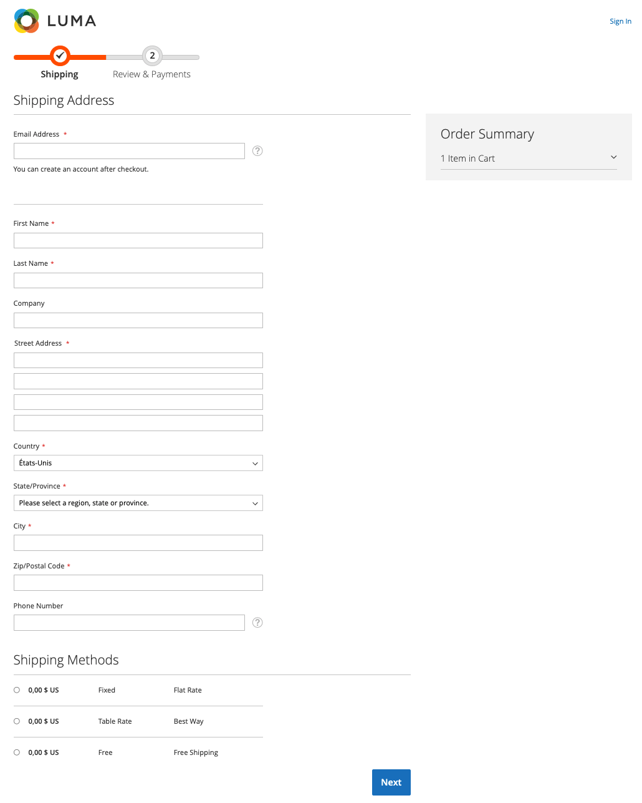

# Adobe Commerce의 체크아웃 페이지

>[!IMPORTANT]
>
> 이 기능은 EAP(Early Adopter Program) 사용자만 사용할 수 있으며 모든 고객이 아직 액세스할 수 없습니다. 현재 미국 고객에게만 제공됩니다. 도움이 필요한 경우 Adobe Commerce 지원 센터에 문의하십시오.

고객이 주문 시 필요한 정보를 입력하는 체크아웃 페이지입니다.

체크아웃 페이지의 예:

Adobe Commerce 표준 체크아웃 페이지에 대한 자세한 내용은 [체크아웃 페이지](https://docs.magento.com/user-guide/quick-tour/checkout-page.html) 주제.

기본적으로 이 체크아웃은 두 단계로 구성됩니다.

- 배송 정보
- 검토 및 지급 정보

>[!NOTE]
>
> 첫 번째 단계를 완료하면 체크아웃에 체크아웃 합계 및 해당 측면 표시줄 정보가 표시됩니다.

자세한 내용은 [체크아웃 흐름](../express-checkout/onboarding.md) 주제 [!DNL Express Checkout] 흐름.
