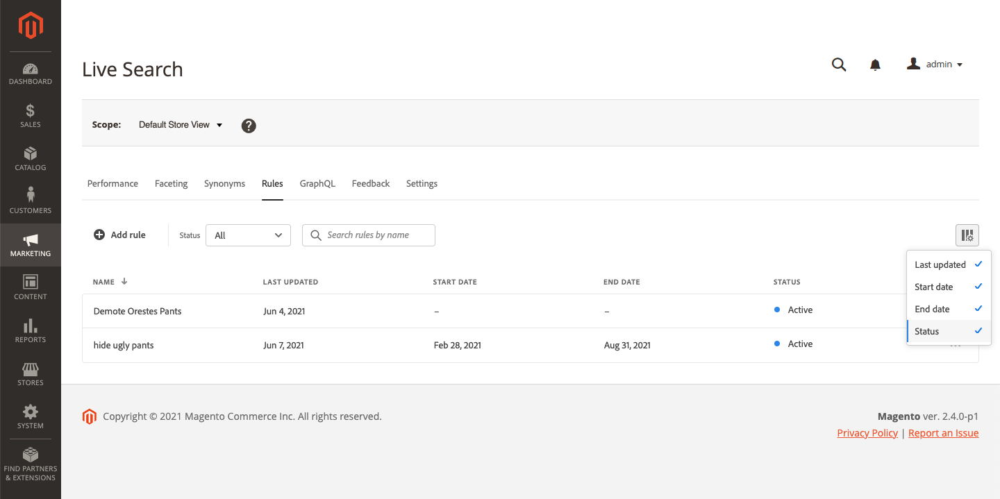

# 규칙 작업 공간

규칙 작업 공간에는 현재 선택한 규칙과 해당 상태가 나열되며 규칙을 만들고 관리하는 데 필요한 도구에 대한 액세스 권한이 제공됩니다. 작업 공간에서 다음 작업을 수행할 수 있습니다.

* 규칙 검색
* 규칙 세부 사항 보기
* 규칙 활성화/비활성화
* 규칙 삭제
* 규칙 편집기 액세스

## 범위 설정

Adobe Commerce 설치에 여러 저장소 보기가 포함된 경우 **범위** 변환 후 [저장소 보기](https://docs.magento.com/user-guide/configuration/scope.html) 규칙이 적용되는 위치.

## 열 표시/숨기기

1. 오른쪽 위 모서리에서 을(를) 클릭합니다. **표시/숨기기**  열.
표시된 열에는 옵션 메뉴에 파란색 확인 표시가 나타납니다. 규칙 이름은 숨길 수 없는 유일한 열입니다.

   

1. 메뉴에서 다음 중 하나를 수행합니다.

   * 숨겨진 열을 표시하려면 확인 표시 없이 열 이름을 클릭합니다.
   * 보이는 열을 숨기려면 확인 표시가 있는 열 이름을 클릭합니다.

   

## 상태별로 규칙 필터링

1. 스토어에 많은 규칙이 있는 경우 상태별로 규칙을 필터링하여 목록을 단축할 수 있습니다. 기본적으로 규칙 목록에는 모든 규칙이 표시됩니다.

   

1. 특정 상태 설정이 있는 규칙만 나열하려면 **상태** 다음 중 하나를 수행합니다.

   * 모두
   * 활성
   * 비활성
   * 예약됨

   

## 이름별로 규칙 검색

규칙 이름 또는 규칙 이름에 단어를 입력합니다.
입력하는 것과 일치하는 규칙을 검색합니다. 찾은 각 규칙 이름에 일치하는 문자 문자열이 강조 표시됩니다.

## 세부 사항 보기

세부 사항 패널에는 규칙 이름, 상태, 조건 및 이벤트, 시작 및 종료 날짜, 설명 및 마지막으로 편집한 날짜가 표시됩니다. 규칙은 세부 사항 패널에서 활성화, 편집 및 삭제할 수 있습니다.

1. 설정 *규칙* 탭에서 보려는 그리드에서 규칙을 찾아 를 클릭합니다 **자세히** ...
1. 클릭 **세부 사항 보기**.
세부 사항 보기 패널에서 다음 중 하나를 수행할 수 있습니다.

   * 규칙 편집
   * 규칙 삭제
   * 규칙 활성화/비활성화

1. 을(를) 닫으려면 *세부 사항 보기* 패널, **닫기** (X) 를 클릭하여 제품에서 사용할 수 있습니다.

   

## 열 설명

| 열 | 설명 |
|--- |--- |
| 이름 | 규칙의 이름입니다. |
| 마지막 업데이트 날짜 | 규칙이 마지막으로 업데이트된 날짜입니다. |
| 시작 날짜 | 예약된 규칙의 시작 날짜입니다. |
| 종료 날짜 | 예약된 규칙의 종료 날짜입니다. |
| 상태 | 색상으로 구분된 상태는 규칙의 현재 상태를 나타냅니다. 그리드 위의 상태 컨트롤을 사용하여 상태별로 규칙을 필터링합니다. 값: 모든 상태 - 상태와 관계없이 모든 규칙을 표시합니다. 활성(파란색) - 활성 규칙만 표시합니다. 예약됨 (주황색) - 예약된 규칙만 표시합니다. 비활성 (회색) - 비활성 규칙만 표시합니다. |

## 컨트롤

| 제어 | 설명 |
|--- |--- |
| 규칙 추가 | 를 엽니다. [규칙 편집기](rules-add.md). |
| 상태 | 상태별로 규칙 목록을 필터링합니다. 옵션: 모두, 활성, 비활성, 예약됨 |
|  | 그리드에 표시되는 열을 지정합니다. 옵션: 마지막 업데이트, 시작 날짜, 종료 날짜, 상태 |
| 검색 | 전체 이름 또는 부분 일치로 규칙을 검색합니다. |
|  | 선택한 규칙에 적용할 수 있는 추가 작업 메뉴를 표시합니다. 옵션: 편집, 세부 정보 보기, 삭제 |

## 규칙 세부 사항

| 필드 | 설명 |
|--- |--- |
| 상태 | 규칙의 현재 상태입니다. |
| 조건 | 규칙과 연관된 조건을 설명하는 검색 쿼리. |
| 시작 날짜 | 예약된 경우 규칙이 적용되는 날짜입니다. |
| 종료 날짜 | 예약된 경우 규칙이 만료되는 날짜입니다. |
| 설명 | 규칙에 대한 간단한 설명. |
| 마지막 업데이트 날짜 | 규칙이 마지막으로 업데이트된 날짜 및 시간입니다. |
| 활성화됨 | 규칙의 상태를 변경하는 컨트롤입니다. 옵션: 활성화/비활성화 |
