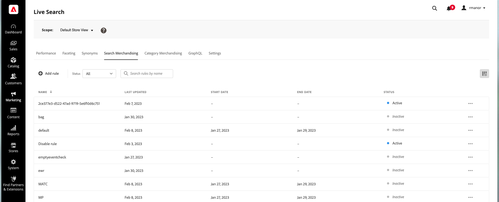

# 규칙 작업 영역

규칙 작업 공간에는 현재 선택된 규칙과 해당 상태가 나열되며 규칙을 만들고 관리하는 데 필요한 도구에 액세스할 수 있습니다. 작업 영역에서 다음 작업을 수행할 수 있습니다.

* 규칙 검색
* 규칙 세부 사항 보기
* 규칙 활성화/비활성화
* 규칙 삭제
* 규칙 편집기 액세스

## 범위 설정

Adobe Commerce 설치에 여러 스토어 보기가 포함된 경우 다음을 설정하십시오. **범위** (으)로 [스토어 뷰](https://experienceleague.adobe.com/docs/commerce-admin/start/setup/websites-stores-views.html#scope-settings) 규칙이 적용되는 위치입니다.

## 열 표시/숨기기

1. 오른쪽 위 모서리에서 을(를) 클릭합니다. **표시/숨기기**  열.
옵션 메뉴에 표시되는 열에는 파란색 확인 표시가 있습니다. 규칙 이름은 숨길 수 없는 유일한 열입니다.

1. 메뉴에서 다음 중 하나를 수행합니다.

   * 숨겨진 열을 표시하려면 확인 표시 없이 열 이름을 클릭합니다.
   * 표시되는 열을 숨기려면 확인 표시가 있는 열 이름을 클릭합니다.

## 상태별 규칙 필터링

1. 스토어에 많은 규칙이 있는 경우 상태별로 규칙을 필터링하여 목록을 줄일 수 있습니다. 기본적으로 규칙 목록에는 모든 규칙이 표시됩니다.

1. 특정 상태 설정이 있는 규칙만 나열하려면 다음을 설정합니다 **상태** 다음 중 하나를 수행합니다.

   * 모두
   * 활성
   * 비활성
   * 예약됨

## 이름별 규칙 검색

규칙 이름을 입력하거나 규칙 이름에 있는 단어를 입력하십시오.
입력할 때 일치하는 규칙을 검색합니다. 발견된 각 규칙의 이름에서 일치하는 문자의 문자열이 강조 표시됩니다.

## 세부 정보 보기

세부 정보 패널에는 규칙 이름, 상태, 조건 및 이벤트, 시작 및 종료 날짜, 설명 및 마지막으로 편집한 날짜가 표시됩니다. 세부 정보 패널에서 규칙을 활성화, 편집 및 삭제할 수 있습니다.

1. 다음에서 *규칙* 탭에서 보려는 그리드에서 규칙을 찾아 **자세히** (...)
1. 클릭 **세부 정보 보기**.
세부 정보 보기 패널에서 다음 중 하나를 수행할 수 있습니다.

   * 규칙 편집
   * 규칙 삭제
   * 규칙 활성화/비활성화

1. 닫으려면 *세부 정보 보기* 패널, 클릭 **닫기** (X) 오른쪽 위 모서리에서 볼 수 있습니다.

   

## 열 설명

| 열 | 설명 |
|--- |--- |
| 이름 | 규칙의 이름입니다. |
| 마지막으로 업데이트됨 | 규칙이 마지막으로 업데이트된 날짜입니다. |
| 시작일 | 예약된 규칙의 시작 날짜입니다. |
| 종료 일자 | 예약된 규칙의 종료 날짜입니다. |
| 상태 | 색상으로 구분된 상태는 규칙의 현재 상태를 나타냅니다. 그리드 위의 Status 컨트롤을 사용하여 상태별로 규칙을 필터링합니다. 값: 모든 상태 - 상태에 관계없이 모든 규칙을 표시합니다. 활성(파란색) - 활성 규칙만 표시합니다. 예약됨(주황색) - 예약된 규칙만 표시합니다. 비활성(회색) - 비활성 규칙만 표시합니다. |

## 컨트롤

| 제어 | 설명 |
|--- |--- |
| 규칙 추가 | 다음을 엽니다. [규칙 편집기](rules-add.md). |
| 상태 | 상태별 규칙 목록을 필터링합니다. 옵션: 모두, 활성, 비활성, 예약됨 |
|  | 격자에 표시되는 열을 지정합니다. 옵션: 마지막 업데이트, 시작 날짜, 종료 날짜, 상태 |
| 검색 | 전체 이름 또는 부분 일치를 사용하여 규칙을 검색합니다. |
|  | 선택한 규칙에 적용할 수 있는 추가 작업의 메뉴를 표시합니다. 옵션: 편집, 세부 정보 보기, 삭제 |

## 규칙 세부 정보

| 필드 | 설명 |
|--- |--- |
| 상태 | 규칙의 현재 상태입니다. |
| 조건 | 규칙과 연관된 조건을 설명하는 검색 쿼리입니다. |
| 시작일 | 규칙이 적용되는 날짜(예약된 경우)입니다. |
| 종료일 | 예약된 경우 규칙이 만료되는 날짜입니다. |
| 설명 | 규칙에 대한 간단한 설명. |
| 마지막으로 업데이트됨 | 규칙이 마지막으로 업데이트된 날짜 및 시간입니다. |
| 활성화됨 | 규칙의 상태를 변경하는 컨트롤입니다. 옵션: 활성화 / 비활성화 |
