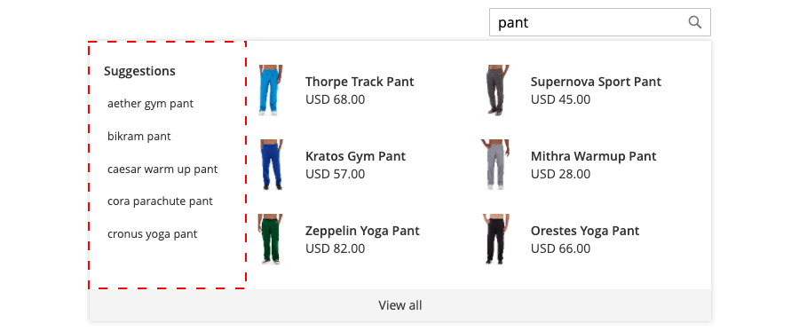

# 스타일링 [!DNL Popover] 요소

다음 [[!DNL storefront popover]](storefront-popover.md) 항상 제품 표시 `name` 및 `price`, 그리고 필드 선택을 구성할 수 없습니다. 하지만, [!DNL popover] 요소는 CSS 클래스를 사용하여 스타일을 지정할 수 있습니다. 예를 들어 다음 선언에서는 [!DNL popover] 컨테이너 및 바닥글.

```css
.livesearch.popover-container {
    background-color: lavender;
}

.livesearch.view-all-footer {
    background-color: magenta;
}
```

## 컨테이너 가시성

의 상위 구성 요소입니다 `.livesearch.popover-container` is `.search-autocomplete`.  다음 `.active` 클래스는 컨테이너의 가시성을 나타냅니다. 다음 `.active` 클래스는 조건부로 추가되면 [!DNL popover] 가 열려 있습니다.

```css
.search-autocomplete.active   /* visible */
.search-autocomplete          /* not visible */
```

storefront 요소 스타일링에 대한 자세한 내용은 [CSS(계단식 스타일 시트)](https://devdocs.magento.com/guides/v2.4/frontend-dev-guide/css-topics/css-overview.html) 에서 [프런트 엔드 개발자 안내서](https://devdocs.magento.com/guides/v2.4/frontend-dev-guide/bk-frontend-dev-guide.html).

## 클래스 선택기

다음 클래스 선택기를 사용하여 [!DNL popover].

* `.livesearch.popover-container`
* `.livesearch.view-all-footer`
* `.livesearch.suggestions-container`
* `.livesearch.suggestions-header`
* `.livesearch.suggestion`
* `.livesearch.products-container`
* `.livesearch.product-result`
* `.livesearch.product-name`
* `.livesearch.product-price`

### 컨테이너 클래스 선택기

`.livesearch.popover-container`

![[!DNL Popover] 컨테이너](assets/livesearch-popover-container.png)

`.livesearch.view-all-footer`


### 제안 클래스 선택기

`.livesearch.suggestions-container`


`.livesearch.suggestions-header`


`.livesearch.suggestion`


### 제품 클래스 선택기

`.livesearch.products-container`


`.livesearch.product-result`


`.livesearch.product-name`


`.livesearch.product-price`


## 수정된 테마 작업 {#working-with-modified-theme}

다음 [!DNL storefront popover] 사용자 지정된 [테마](https://devdocs.magento.com/guides/v2.3/frontend-dev-guide/themes/theme-overview.html) 에서 필요한 파일을 상속함 *루마*. 다음 `top.search` 블록 `header-wrapper` 의 `Magento_Search` 모듈을 수정할 수 없습니다.

```html
<referenceContainer name="header-wrapper">
   <block class="Magento\Framework\View\Element\Template" name="top.search" as="topSearch" template="Magento_Search::form.mini.phtml">
      <arguments>
         <argument name="configProvider" xsi:type="object">Magento\Search\ViewModel\ConfigProvider</argument>
      </arguments>
   </block>
</referenceContainer>
```

## 비활성화 [!DNL popover]

를 비활성화하려면 [!DNL popover] 표준 [빠른 검색](https://docs.magento.com/user-guide/catalog/search-quick.html) 기능을 사용하려면 다음 명령을 입력합니다.

```bash
bin/magento module:disable Magento_LiveSearchStorefrontPopover
```
