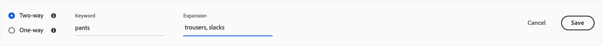
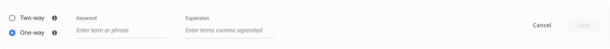

# 동의어 추가

선별된 목록을 직접 추가합니다. [!DNL Live Search] 검색 요청에 대한 응답을 개선하고 고객의 참여를 유지하기 위한 동의어입니다.

![[!DNL Live Search] 동의어](assets/synonym-workspace.png)

## 1단계: 동의어 추가

1. 관리에서 **마케팅** > SEO &amp; Search > **[!DNL Live Search]**.
1. 여러 스토어의 경우 **범위** 변환 후 [저장소 보기](https://docs.magento.com/user-guide/configuration/scope.html) 여기서 동의어 설정이 적용됩니다.
1. 을(를) 클릭합니다. **동의어** 탭.
1. 을(를) 클릭합니다. **동의어 추가** 버튼을 클릭합니다.

## 2단계: 유형별 동의어 정의

다음 사항에 대한 지침을 따르십시오. [동의어 유형](synonyms-type.md) 만들 수 있습니다.

### 양방향 동의어

1. 기본값을 사용합니다 **양방향** 선택 사항입니다.

   

1. 을(를) 입력합니다. **키워드** 일치하는 용어 또는 구문입니다.
1. 을(를) 입력합니다. **확장** 키워드의 동의어로 추가할 용어입니다. 여러 용어는 쉼표로 구분하십시오.
이 예에서 일치시킬 키워드는 &quot;pants&quot;이고 확장 용어 집합은 &quot;긴 바지, 바지, 바지&quot;입니다.

   

1. 완료되면 를 클릭합니다. **저장**.
동의어 세트는 용어를 서로 바꿔서 사용할 수 있음을 의미하는 양방향 화살표가 있는 목록에 나타납니다.

   

### 단방향 동의어

1. 을(를) 클릭합니다. **단방향** 동의어 유형.

   

1. 을(를) 입력합니다. **키워드** 및 **확장** 용어 여러 용어는 쉼표로 구분하십시오.

   

   이 예에서 키워드는 &quot;pants&quot;이고 단방향 확장 용어 &quot;capris, spare-length pants, pedle-pusher&quot;는 각각 &quot;pants&quot;의 하위 집합이지만 구체적인 의미의 하위 집합입니다.

1. 완료되면 를 클릭합니다. **저장**.
동의어 세트는 확장 용어에서 키워드까지 가리키는 단방향 화살표가 있는 목록에 나타나며 이 화살표는 키워드의 하위 세트임을 나타냅니다. 더하기 기호는 각 확장 용어를 구분합니다.

   

## 3단계: 변경 사항 게시

1. 동의어가 완료되면 **변경 사항 게시**.
1. 업데이트를 상점 앞에서 이용할 수 있도록 최대 2시간을 기다리십시오.

## 필드 설명

| 필드 | 설명 |
|--- |--- |
| [유형](synonyms.md) | 동의어가 키워드와 동일한 의미를 갖는지, 또는 키워드의 하위 세트인지 여부를 결정합니다. 옵션: 양방향(기본값) - 키워드와 동일한 의미를 가지고 동일한 검색 결과를 반환하는 용어입니다 단방향 - 키워드의 하위 집합인 용어입니다. 단방향 동의어는 특정 제품의 더 좁은 목록을 반환합니다. |
| 키워드 | 일반적으로 카탈로그의 제품 선택과 연관된 단어입니다. |
| 확장 | 키워드와 동일하거나 유사한 의미를 갖는 추가 용어입니다. |
