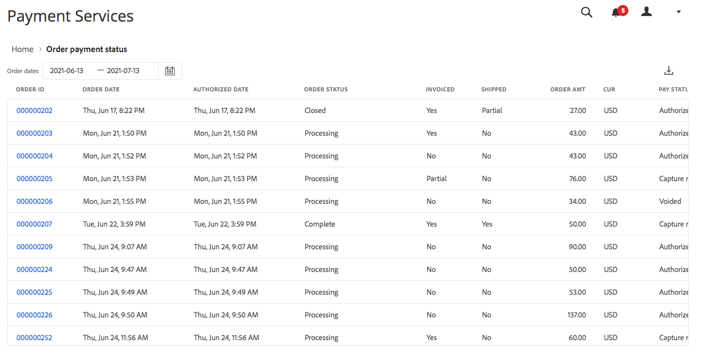

# 주문 결제 상태 보고서

[!DNL Payment Services] 대상 [!DNL Adobe Commerce] 및 [!DNL Magento Open Source] 에서는 상점의 주문 및 결제를 명확하게 볼 수 있도록 포괄적인 보고를 제공합니다.

주문 결제 상태 보고서를 통해 주문-현금화 프로세스 흐름 내에서 특정 주문이 어디에 있는지 쉽게 파악할 수 있습니다. 이 보고서를 사용하면 주문 결제 상태를 빠르게 조회하고 잠재적인 문제를 식별할 수 있습니다.

수동으로 참조 주문 및 지급을 교차하기 위해 여러 뷰를 열 필요가 없습니다. [!DNL Payment Services] 대상 [!DNL Adobe Commerce] 및 [!DNL Magento Open Source] 주문 및 결제에 대한 모든 정보를 주문 결제 상태 보고서에서 한눈에 확인할 수 있습니다.

관리자의 이 보고서 내에서 결제 상태, 송장발행 및 배송 상태, 환불 상태, 분쟁 상태 등을 모두 확인하십시오.

기존 회계 또는 주문 관리 소프트웨어에서 사용할 수 있도록 주문 결제 상태 트랜잭션을 .csv 파일 형식으로 다운로드할 수 있습니다.

>[!NOTE]
>
>그렇지 않은 경우 재무 보고서를 볼 수 없습니다 [온보딩 및 활성화된 라이브 모드](production.md#enable-live-payments) 대상 [!DNL Payment Services].

## 보고서에 사용된 데이터

다음 [!DNL Payment Services] 모듈은 주문 데이터를 사용하여 다른 소스(PayPal 포함)의 결제 데이터와 결합하여 의미 있고 유용한 보고서를 제공합니다.

주문 데이터를 내보내고 결제 서비스에서 유지합니다. 다음을 수행하는 경우 [주문 상태 변경 또는 추가](https://docs.magento.com/user-guide/sales/order-status-custom.html){target="_blank"} or [edit a store view](https://docs.magento.com/user-guide/stores/stores-all-view-edit.html){target="_blank"}, [store](https://docs.magento.com/user-guide/stores/store-information.html){target="_blank"}또는 웹 사이트 이름으로, 이 데이터는 결제 데이터와 결합되고 주문 결제 상태 보고서는 결합된 정보로 채워집니다.

이 프로세스에는 두 가지 단계가 있습니다.

1. 색인이 다음 중 하나의 데이터로 변경되었습니다. `ON SAVE` (주문 정보 또는 스토어 정보가 변경될 때마다) 또는 `BY SCHEDULE` (사전 구성된 cron 일정에 따라), 구성 방법에 따라 [색인 관리](https://docs.magento.com/user-guide/system/index-management.html){target="_blank"} 관리에서.

   기본적으로 데이터 인덱싱이 발생합니다 `ON SAVE`즉, 주문, 주문 상태, 스토어 보기, 스토어 또는 웹 사이트에서 변경 사항이 있을 때마다 색인 재지정 프로세스가 즉시 수행됩니다.

1. 인덱스화된 데이터가 결제 서비스로 전송되면 주문 결제 상태 보고서에 채워집니다.

보고 목적으로 내보내고 정렬하는 데이터는 주문 결제 상태 보고서에서 사용하는 데이터뿐입니다.

>[!NOTE]
>
>이 표에 표시된 데이터는 내림차순으로 정렬됩니다(`DESC`) 기본적으로 `ORDER DATE`. 다음 `ORDER DATE` 는 주문이 생성된 날짜 타임스탬프입니다.

### 데이터 내보내기 구성

기본적으로 리인덱싱이 수행되지만 `ON SAVE` 모드,에서 색인화하는 것이 좋습니다. `BY SCHEDULE` 모드. 다음 `BY SCHEDULE` 색인은 1분의 cron 일정에 따라 실행되며, 변경된 데이터는 데이터 변경 후 2분 이내에 Order status 보고서에 표시됩니다. 이러한 예약된 리인덱싱은 특히 들어오는 주문량이 많은 경우 각 주문이 아닌 일정에 따라 발생하므로 스토어에 대한 부담을 줄이는 데 도움이 됩니다.

인덱스 모드를 변경할 수 있습니다—`ON SAVE` 또는 `BY SCHEDULE`—[관리자](https://docs.magento.com/user-guide/system/index-management.html#change-the-index-mode){target="_blank"}.

데이터 내보내기를 구성하는 방법에 대해 알아보려면 다음을 참조하십시오. [명령줄 구성](configure-cli.md#configure-data-export).

## 사용 가능

다음에서 _관리자_ 사이드바, 이동 **[!UICONTROL Sales]** > **[!UICONTROL Payment Services]** > **[!UICONTROL Order payment status]** 주문에 대한 지급 상태를 조회합니다.

## 데이터 소스 선택

주문 결제 상태 보고서 보기에서 데이터 소스를 선택할 수 있습니다._[!UICONTROL Live]_또는_[!UICONTROL Sandbox]_- 보고서 결과를 보려는 경우

If _[!UICONTROL Live]_은(는) 선택한 데이터 소스이며, 다음을 사용하는 스토어에 대한 보고서 정보를 볼 수 있습니다. [!DNL Payment Services] 위치:_[!UICONTROL Live]_ 모드. If [!UICONTROL Sandbox]은(는) 선택한 데이터 소스이며, 샌드박스 환경에 대한 보고서 정보를 볼 수 있습니다.

데이터 소스 선택은 다음과 같이 작동합니다.

* 를 사용하는 스토어가 없는 경우 [!DNL Payment Services] 라이브 모드에서 데이터 소스 선택 기본값은 입니다. _[!UICONTROL Sandbox]_.
* 을 사용하는 스토어(하나 또는 여러 개)가 있는 경우 [!DNL Payment Services] 라이브 모드에서 데이터 소스 선택 기본값은 입니다. _[!UICONTROL Live]_.
* 보고서 내보내기는 항상 데이터 소스 선택을 따릅니다.

에 대한 데이터 소스를 선택하려면 다음을 수행하십시오. [!UICONTROL Order Payment Status] 보고서:

1. 다음에서 _관리자_ 사이드바, 이동 **[!UICONTROL Sales]** > **[!UICONTROL [!DNL Payment Services]]** > **[!UICONTROL Order payment status]**.
1. 클릭 **[!UICONTROL Data source]** 및 선택 _[!UICONTROL Live]_또는_[!UICONTROL Sandbox]_.

   선택한 데이터 소스를 기반으로 보고서 결과가 재생성됩니다.

## 날짜 일정 사용자 지정

주문 지급 상태 보고서 보기에서, 특정 일자를 선택하여 보려는 상태의 시간대를 사용자 정의할 수 있습니다. 기본적으로 30일의 주문 결제 상태가 그리드에 표시됩니다.

1. 다음에서 _관리자_ 사이드바, 이동 **[!UICONTROL Sales]** > **[!UICONTROL [!DNL Payment Services]]** > **[!UICONTROL Order payment status]**.
1. 다음을 클릭합니다. **[!UICONTROL Order dates]** 달력 선택기 필터.
1. 적용 가능한 날짜 범위를 선택합니다.
1. 그리드에서 지정한 일자에 대한 주문 지급 상태를 조회합니다.

## 열 표시 및 숨기기

주문 결제 상태 보고서에는 기본적으로 사용 가능한 모든 정보 열이 표시됩니다. 그러나 보고서에 표시되는 열을 사용자 지정할 수 있습니다.

1. 다음에서 _관리자_ 사이드바, 이동 **[!UICONTROL Sales]** > **[!UICONTROL [!DNL Payment Services]]** > **[!UICONTROL Order payment status]**.
1. 다음을 클릭합니다. _열 설정_ 아이콘().
1. 보고서에 표시되는 열을 사용자 지정하려면 목록에서 열을 선택하거나 선택 취소합니다.

   주문 결제 상태 보고서에는 열 설정 메뉴에서 변경한 사항이 즉시 표시됩니다. 열 환경 설정이 저장되며 보고서 보기에서 나가면 적용됩니다.

## 상태 보기

주문 지급 상태 보고서 뷰에는 각 지급 서비스 주문에 대한 포괄적인 거래 상태 및 지급 상태 정보가 표시됩니다.

### 거래 상태

기본적으로 30일의 주문 결제 상태가 그리드에 표시됩니다.

왼쪽과 오른쪽으로 스크롤하여 보기 [주문 결제 상태 정보](#column-descriptions), 주문 날짜, 승인 날짜, 송장 발행, 배송, 결제 상태 등.

검색에서 반환되거나 기본 30일 주문 결제 상태에 표시되는 행 수는 주문 날짜 달력 선택기 필터와 함께 주문 결제 상태 보기 그리드 위에 표시됩니다.

### 지급 상태

지급 상태 열에는 지급의 현재 상태가 표시됩니다. A `Capture failed` 결제에 빨간색 경고 상태 및 `Voided` 결제에 회색 경고 상태가 표시됩니다.

### 환불 상태

환불 상태 열에는 환급의 현재 상태가 표시됩니다. A `Capture failed` 결제에 빨간색 경고 상태 및 `Voided` 결제에 회색 경고 상태가 표시됩니다.

## 보고서 데이터 업데이트

주문 결제 상태 보고서 보기에 _[!UICONTROL Last updated]_보고서 정보가 마지막으로 업데이트된 시간을 보여 주는 타임스탬프입니다. 기본적으로 주문 결제 상태 보고서 데이터는 3시간마다 자동으로 새로 고쳐집니다.

주문 지급 상태 보고서 데이터를 수동으로 새로 고쳐 최신 보고서 정보를 볼 수도 있습니다.

1. 다음에서 _관리자_ 사이드바, 이동 **[!UICONTROL Sales]** > **[!UICONTROL [!DNL Payment Services]]** > **[!UICONTROL Order payment status]**.
1. 다음을 클릭합니다. _새로 고침_ 아이콘().

   주문 결제 상태 보고서 데이터가 새로 고쳐졌습니다. *[!UICONTROL Update complete]* 확인이 나타나고 최신 정보가 표에 표시됩니다.

## 분쟁 보기

주문 결제 상태 보고서에서 스토어의 주문에 대한 모든 분쟁을 조회하고 PayPal 해결 센터로 이동하여 이에 대한 조치를 취할 수 있습니다.

1. 다음에서 _관리자_ 사이드바, 이동 **[!UICONTROL Sales]** > **[!UICONTROL [!DNL Payment Services]]** > **[!UICONTROL Order payment status]**.
1. 다음 위치로 이동 **[!UICONTROL Disputes column]**.
1. 특정 주문에 대한 모든 분쟁을 조회하고 다음을 참조하십시오. [분쟁 상태](#order-payment-status-information).
1. 분쟁 ID 링크(다음으로 시작)를 클릭합니다 _PP-D-_)으로 이동합니다. [PayPal 해결 센터](https://www.paypal.com/us/smarthelp/article/what-is-the-resolution-center-faq3327).
1. 필요에 따라 분쟁에 대해 적절한 조치를 취하십시오.

   상태별로 주문 분쟁을 정렬하려면 분쟁 열 헤더를 누릅니다.

## 주문 결제 상태 다운로드

기본 30일 상태 또는 사용자 정의된 기간을 보는지 여부에 관계없이 주문 결제 상태 보기 그리드에 모든 상태가 표시되는 .csv 파일을 다운로드할 수 있습니다.

1. 다음에서 _관리자_ 사이드바, 이동 **[!UICONTROL Sales]** > **[!UICONTROL [!DNL Payment Services]]** > **[!UICONTROL Order payment status]**.
1. 지난 30일 이외의 다른 기간에 대한 상태를 보려면 [상태에 대한 날짜 범위 일정 사용자 정의](#customize-dates-timeframe).
1. 다음을 클릭합니다. _다운로드_ () 아이콘.

주문 결제 상태는 .csv 형식으로 다운로드됩니다.

<!-- ## Default order payment status timeframes

These order payment status timeframes are currently available in [!DNL Payment Services].

| Report       | Description          |
| ------------ | -------------------- |
| Yesterday | Available from the Order payment status dates selector, this shows information for the prior date. |
| | Today | Available from the Order payment status dates selector, this shows information for the current day. |
| Last 7 days | Available from the Order payment status dates selector, this shows information for the last seven days. |
| Last 30 days | Available from the Order payment status dates selector and by default in the Order payment statuses view, this shows information for the last 30 days. |
| Last 90 days | Available from the Order payment status dates selector, this shows information for the last 90 days. |
| Year to date | Available from the Order payment status dates selector, this shows information for the the entire year to date. |
| Custom range | Available from the Order payment status dates selector, this can be filtered to show a custom date range. |
-->

## 주문 결제 상태 정보

주문 결제 상태 보기에는 그리드에 표시된 각 상태에 대한 광범위한 정보가 표시됩니다.

### 열 설명

주문 결제 상태 보고서에는 다음 정보가 포함됩니다.

| 열 | 설명 |
| ------------ | -------------------- |
| [!UICONTROL Order ID] | 상거래 주문 ID   관련 항목 보기 [주문 정보](https://docs.magento.com/user-guide/sales/orders.html){target="_blank"}를 클릭하고 ID를 클릭합니다. |
| [!UICONTROL Order Date] | 주문 날짜 타임스탬프 |
| [!UICONTROL Authorized Date] | 결제 권한 부여의 날짜 타임스탬프 |
| [!UICONTROL Order Status] | 현재 상거래 [주문 상태](https://docs.magento.com/user-guide/sales/order-status.html){target="_blank"} |
| [!UICONTROL Invoiced] | 주문 송장 상태—*[!UICONTROL No]*, *[!UICONTROL Partial]*, 또는 *[!UICONTROL Yes]* |
| [!UICONTROL Shipped] | 주문 배송 상태—*[!UICONTROL No]*, *[!UICONTROL Partial]*, 또는 *[!UICONTROL Yes]* |
| [!UICONTROL Order Amt] | 총 주문 금액 |
| [!UICONTROL Cur] | 주문 통화 유형 |
| [!UICONTROL Pay Status] | 특정 주문에 대한 결제 상태 |
| [!UICONTROL Paid Amt] | 주문에서 지불된 금액 |
| [!UICONTROL Cur] | 주문에 대해 지불된 금액의 통화 유형 |
| [!UICONTROL Refund Status] | 주문 환불 상태(예: 반품, RMA 및 대변 메모의 정보)   *[!UICONTROL Requires refund]*, *[!UICONTROL Refund requested]*, *[!UICONTROL Refunded]*, *[!UICONTROL Refund failed]*, 또는 *[!UICONTROL Voided]* |
| [!UICONTROL Refund Amount] | 주문에 대한 총 환불 금액 |
| [!UICONTROL Cur] | 주문에 대해 환급한 금액의 통화 유형 |
| [!UICONTROL Disputes] | 주문에 대한 분쟁 상태(분쟁 및 요금 청구에 대한 정보)—*[!UICONTROL Open]*, *[!UICONTROL Waiting for buyer response]*, *[!UICONTROL Waiting for seller response]*, *[!UICONTROL Under review]*, *[!UICONTROL Resolved]*, 또는 *[!UICONTROL Other]* |
| [!UICONTROL Payment Method] | 주문에 대한 상거래 거래에 사용되는 결제 방법 |
| [!UICONTROL Website] | 주문이 접수된 웹 사이트 |
| [!UICONTROL Store] | 주문된 스토어 |
| [!UICONTROL Store View] | 주문이 이루어진 스토어 뷰 |
