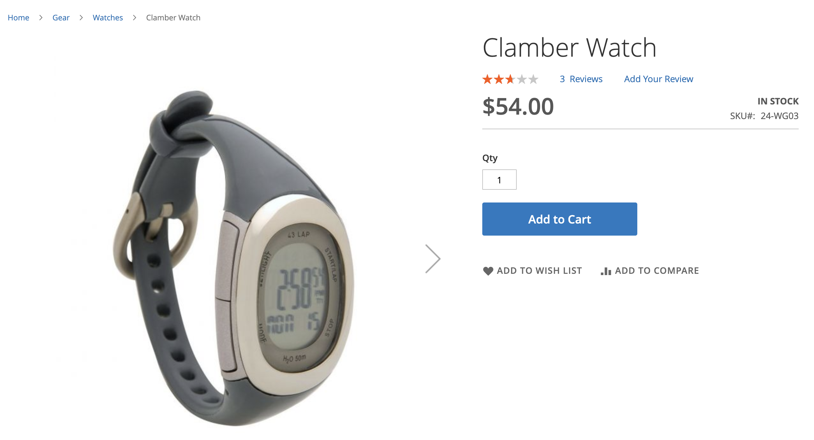

# 권장 사항 유형

Adobe Commerce은 사이트의 다양한 페이지에 배포할 수 있는 대규모 권장 사항 세트를 제공합니다. 모든 권장 사항 유형은 데이터 기반입니다. 작동 데이터, 제품 속성 데이터 및 지표를 통해 제공됩니다. 쉽게 참조할 수 있도록 추천 유형은 다음과 같이 그룹화됩니다.

- [개인화됨](#personalized)
- [교차 판매 및 상향 판매](#crossup)
- [인기도](#popularity)
- [고성능](#highperf)

권장 사항을 사용할 때 Adobe은 다음 지침을 권장합니다.

- 추천 유형을 다양화합니다. 고객이 동일한 제품을 반복해서 제안하면 권장 사항을 무시하기 시작합니다.

- 동일한 권장 사항을 장바구니 페이지와 주문 확인 페이지에 배포하지 마십시오. 사용 고려 `Most Added to Cart` 장바구니 페이지 및 `Bought This, Bought That` 주문 확인 페이지에 사용됩니다.

- 사이트를 깔끔하게 유지하십시오. 동일한 페이지에 권장 사항 단위를 3개 이상 배포하지 마십시오.

- 옷만 팔면, `More like this` 권장 사항은 보고 있는 제품의 성별과 일치하지 않는 성별 특정 제품을 제안할 수 있습니다. 비의류 카테고리에 대해서만 이 권장 사항 유형을 사용하는 것이 좋습니다.

## 개인화됨 {#personalized}

이러한 추천 유형은 사이트에서의 특정 쇼핑객 행동 이력에 따라 제품을 추천합니다.

| 유형 | 설명 |
|---|---|
| 추천 항목 | 각 구매자의 현재 및 이전 현장 행동에 따라 제품을 추천합니다. 구매자의 검색 및 구매 기록을 기반으로 관련성이 높은 권장 사항을 표시합니다. 이 권장 사항 유형은 대부분의 쇼핑객이 사이트에서 여정을 시작하는 홈 페이지에 적용됩니다. 사이트에서 경험을 개인화할 신호를 생성하지 않은 최초 구매자의 경우 Adobe Commerce에서 가장 많이 본 추천 유형을 기반으로 제품을 표시합니다. 그러나 쇼핑객이 사이트에서 제품과 상호 작용하기 시작하면 권장 제품이 그들의 행동에 맞게 실시간으로 조정됩니다.  **사용 위치:** - 홈 페이지 - 범주&#x200B;  **추천 레이블:**  - 귀하를 위한 - 추천 항목 - 귀하의 쇼핑 트렌드에 의해 영감을 |
| 최근에 본 항목 | 브라우저 기록을 기반으로 쇼퍼가 가장 최근에 본 제품을 표시합니다. 삭제된 모든 제품은 권장 사항 단위에 의해 제거됩니다. 브라우저 기록이 없거나 필터 규칙을 적용할 때 충분한 기록이 없는 경우 추천 단위가 표시되지 않습니다. 결과에 구성된 것보다 적은 수의 제품이 포함된 경우 추천 단위는 반환된 제품만 표시합니다.  **사용 위치:** - 홈 페이지 - 범주 - 제품 세부 사항 - 장바구니 - 확인&#x200B;  **추천 레이블:** - 최근에 본 항목 - 다른 항목 살펴보기 |

## 교차 판매 및 상향 판매 {#crossup}

이러한 권장 사항 유형은 다른 사람이 좋아하는 것을 찾는 것을 돕거나 다른 유사한 제품을 찾는 것을 돕는 제품 중심의 소셜 증명입니다

| 유형 | 설명 |
|---|---|
| 이 항목을 보고 다른 항목도 보았습니다. | 는 구매자가 현재 보고 있는 제품에 비해 불균형적으로 더 자주 보는 제품을 권장합니다.  **사용 위치:** - 제품 세부 사항 - 장바구니 - 확인&#x200B;  **추천 레이블:** - 이 제품을 본 고객이 PDP(시청)도 보았음 |
| 이 항목을 보고 다른 항목을 구입함 | 는 구매자가 현재 제품을 본 후 불균형적으로 더 자주 구매하는 경향이 있는 제품을 권장합니다. 구매자가 다른 방법으로는 인식하지 못했을 수 있는 제품을 발견하도록 안내합니다.  **사용 위치:** - 제품 세부 사항 - 장바구니 - 확인&#x200B;  **추천 레이블:** - 이 최종 구매를 본 고객 - 최종 구매한 고객 다른 사람들은 이 제품을 보고 뭘 사나요? |
| 구매, 구매 | 는 현재 표시된 제품을 사용하여 쇼핑객이 불균형적으로 더 자주 구매하는 제품을 권장합니다. 평균 주문 가격을 높이기 위해 관련 크로스셀 제품의 노출을 늘리기 위해 장바구니 또는 제품 세부 사항 페이지에서 가장 많이 사용됩니다. 관련성이 높은 제품을 표시하면 다른 구매자가 현재 제품과 함께 구매한 내용을 집계하여 장바구니에 추가할 수 있습니다.  **사용 위치:** - 제품 세부 사항 - 장바구니 - 확인&#x200B;  **추천 레이블:** - 필요한 모든 기능 제공 - 다음 항목을 잊지 마십시오. - 함께 자주 구매 |
| 다음과 같음 | 이름, 설명, 범주 할당 및 속성과 같은 유사한 메타데이터를 기반으로 제품을 권장합니다. 는 보고 있는 제품의 속성을 평가하여 동일한 카테고리의 유사한 제품을 추천합니다. 예를 들어 쇼핑객이 요가 매트를 둘러보고 있다면 장비 카테고리의 다른 제품이 추천된다. 이 권장 유형은 성별을 구분하지 않으므로 의류, 패션 또는 기타 성별 특정 버티컬에는 권장되지 않습니다.  **사용 위치:** - 제품 세부 사항 - 장바구니 - 확인&#x200B;  **추천 레이블:**  - 이와 유사한 제품 더 보기 - 다음과 유사 |
| [시각적 유사성](#visualsim) | 는 보고 있는 제품과 유사한 형태의 제품을 권장합니다. 이 권장 사항 유형은 이미지와 제품의 시각적 측면이 쇼핑 경험에 중요한 경우 가장 유용합니다. |

## 인기도 {#popularity}

이러한 추천 유형은 최근 7일 이내에 가장 인기 있거나 트렌드가 있는 제품을 추천합니다.

| 유형 | 설명 |
|---|---|
| 가장 많이 본 항목 | 최근 7일 이내에 보기 작업이 발생한 세션 수를 계산하여 가장 많이 본 제품을 권장합니다.  **사용 위치:** - 홈 페이지 - 범주 - 제품 세부 사항 - 장바구니 - 확인&#x200B;  **추천 레이블:** - 추천 - 트렌드 - 현재 인기 항목 - 최근 인기 항목 - 이 제품에서 영감을 얻은 인기 제품(PDP) - 최상위 판매자 |
| 최다 구매 | 지난 7일 이내에 쇼핑객이 가장 많이 구매한 제품을 추천합니다.  **사용 위치:** - 홈 페이지 - 범주 - 제품 세부 사항 - 장바구니 - 확인&#x200B;  **추천 레이블:**  - 추천 - 트렌드 - 현재 인기 항목 - 최근 인기 항목 - 이 제품에서 영감을 얻은 인기 제품(PDP) - 최상위 판매자 |
| 장바구니에 가장 많이 추가됨 | 지난 7일 이내에 쇼핑객이 카트에 가장 많이 추가한 제품을 추천합니다. 이 권장 사항 유형은 모든 페이지에서 사용할 수 있습니다.  **사용 위치:** - 홈 페이지 - 범주 - 제품 세부 사항 - 장바구니 - 확인&#x200B;  **추천 레이블:**  - 추천 - 트렌드 - 현재 인기 항목 - 최근 인기 항목 - 이 제품에서 영감을 얻은 인기 제품(PDP) - 최상위 판매자 |
| 트렌딩 | 는 사이트 전체에서 제품 인기의 최근 모멘텀을 기반으로 제품을 추천합니다.  Adobe Sensei은 사이트 전체의 탐색 및 구매 데이터를 집계하여 가장 최근에 구매자에게 인기 있는 제품을 결정하고 등급을 매깁니다. Trending은 최근 제품 모멘텀을 분석하므로 매출액이 높은 카탈로그에 효과적인 추천 유형입니다. 카탈로그가 더 정적인 경우 대상의 쇼핑 패턴이 매우 변동이 심하지 않는 한 유용하지 않을 수 있습니다.  홈페이지에서 를 사용하는 경우 Trending은 전체 사이트에서 최근에 많이 사용되는 제품을 추천합니다. 트렌딩은 지속적으로 인기가 있는 제품을 표시하는 것이 아니라 최근 인기를 끌고 있는 제품을 표시하는 것이다. 예를 들어 특정 제품을 홍보하는 이메일 마케팅 캠페인이 있는 경우, 이메일에 의해 생성된 인기도 증가는 홍보된 제품이 트렌드로 분류될 가능성을 높입니다.  **사용 위치:** - 홈 페이지 - 범주 - 제품 세부 사항 - 장바구니 - 확인&#x200B;  **추천 레이블:** - 트렌드 - 현재 트렌드 - 최근 트렌드 - 핫제품 - 트렌드 관련 제품(PDP) |

## 고성능 {#highperf}

이러한 권장 사항 유형은 장바구니에 추가 또는 전환율과 같은 성공 기준을 기반으로 최고의 성능을 발휘하는 제품을 권장합니다.

| 유형 | 설명 |
|---|---|
| 구매 전환으로 보기 | 보기-구매 전환율이 가장 높은 제품을 권장합니다. 제품 보기를 등록한 모든 쇼핑객 세션 중에서 쇼핑객이 구매를 등록한 비율은 얼마입니까?  **사용 위치:** - 홈 페이지 - 범주 - 제품 세부 사항 - 장바구니 - 확인&#x200B;  **추천 레이블:**  -최상위 판매자 - 인기 제품 - 다음 작업에 관심이 있을 수 있습니다. |
| 장바구니로 전환 보기 | 보기-장바구니 전환율이 가장 높은 제품을 권장합니다. 제품 보기를 등록한 모든 쇼핑객 세션 중 쇼핑객이 장바구니에 추가를 등록한 비율은 얼마입니까?  **사용 위치:** - 홈 페이지 - 범주 - 제품 세부 사항 - 장바구니 - 확인&#x200B;  **추천 레이블:**  - 최상위 판매자 - 인기 제품 - 다음 작업에 관심이 있을 수 있습니다. |
| 최다 구매 | 종종 &quot;최상위 판매자&quot;라고도 하는 이 권장 사항 유형은 지난 7일 이내에 주문 작업이 발생한 세션의 수를 계산합니다. 이 권장 사항 유형은 모든 페이지에서 사용할 수 있습니다.  **사용 위치:** - 홈 페이지 - 범주 - 제품 세부 사항 - 장바구니 - 확인&#x200B;  **추천 레이블:**  - 추천 - 트렌드 - 현재 인기 항목 - 최근 인기 항목 - 이 제품에서 영감을 얻은 인기 제품(PDP) - 최상위 판매자 |
| 장바구니에 가장 많이 추가됨 | 지난 7일 이내에 쇼핑객이 카트에 가장 많이 추가한 제품을 추천합니다. 이 권장 사항 유형은 모든 페이지에서 사용할 수 있습니다.  **사용 위치:** - 홈 페이지 - 범주 - 제품 세부 사항 - 장바구니 - 확인&#x200B;  **추천 레이블:**  - 추천 - 트렌드 - 현재 인기 항목 - 최근 인기 항목 - 이 제품에서 영감을 얻은 인기 제품(PDP) - 최상위 판매자 |

## 시각적 유사성 {#visualsim}

다음 _시각적 유사성_ 권장 사항 유형은 보고 있는 제품과 유사한 형태의 제품을 권장합니다. 이 권장 사항 유형은 제품의 이미지와 시각적 측면이 쇼핑 경험의 중요한 부분인 경우 가장 유용합니다.

### 작동 방식

다음 _시각적 유사성_ recommendation 유형은 현재 보고 있는 이미지와 시각적으로 유사한 카탈로그의 다른 제품에 대한 권장 사항을 제공합니다. 시각적 유사성에는 다음과 같은 측면이 포함됩니다.

- 색상
- 모양
- 크기
- 텍스처
- 재질
- 스타일

Adobe Sensei은 AI를 사용하여 카탈로그의 이미지를 처리하고 분석하고 시각적 유사성을 판별하는 데 사용되는 속성을 빌드합니다.

>[!NOTE]
>
> 비프로덕션 환경에서 이 권장 사항 유형을 테스트하는 경우 이미지 URL에 공개적으로 액세스할 수 있는지 확인하십시오.

>[!NOTE]
>
> 현재 제품 이미지의 크기는 10MB 이하여야 합니다.

이 권장 사항 유형은 대부분의 카탈로그에 적용할 수 없으므로 기본적으로 활성화되지 않습니다. 이 권장 사항 유형을 명시적으로 활성화해야 합니다.

### 시각적 유사성 추천 유형 활성화

>[!NOTE]
>
> 다음 _시각적 유사성_ 다음과 같은 경우 권장 사항 유형을 사용할 수 있습니다. [설치](install-configure.md) 선택적 모듈입니다.

1. 다음에서 _관리자_ 사이드바, 이동 **마케팅** > _프로모션_ > **제품 Recommendations** 을(를) 표시하려면 _제품 Recommendations_ 대시보드입니다.

1. 클릭 **설정** (톱니바퀴 아이콘) _설정_ 페이지를 가리키도록 업데이트하는 중입니다.

1. 다음에서 _Visual Recommendations_ 섹션, 다음을 선택: **Visual Recommendations 활성화**.

1. 클릭 **변경 내용 저장** 다 끝나면

   다음 [새 권장 사항 만들기](create.md) 이제 페이지가 표시됨 **시각적 유사성** 페이지 유형이 다음과 같은 경우 선택 가능한 추천 유형으로 **제품 세부 사항**.

시각적 권장 사항을 활성화하면 Adobe Sensei에서 이미지 처리를 시작합니다. 소요 시간은 카탈로그의 크기에 따라 다릅니다.

### 사용 위치

- 제품 세부 사항

### 제안된 상점 첫 화면 레이블

- 다음 항목도 살펴보십시오.
- 마음에 드실 다른 제품을 찾았습니다.
- 이 스타일에서 영감을 얻음

### 예

다음 이미지는 다음에 대한 제품 세부 사항 페이지를 보여 줍니다. _기어 감시_:

다음은 _시각적 유사성_ 추천 단위 _기어 감시_:

