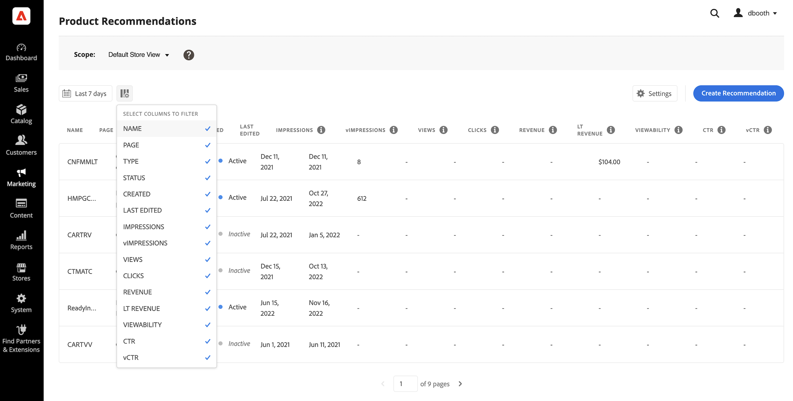
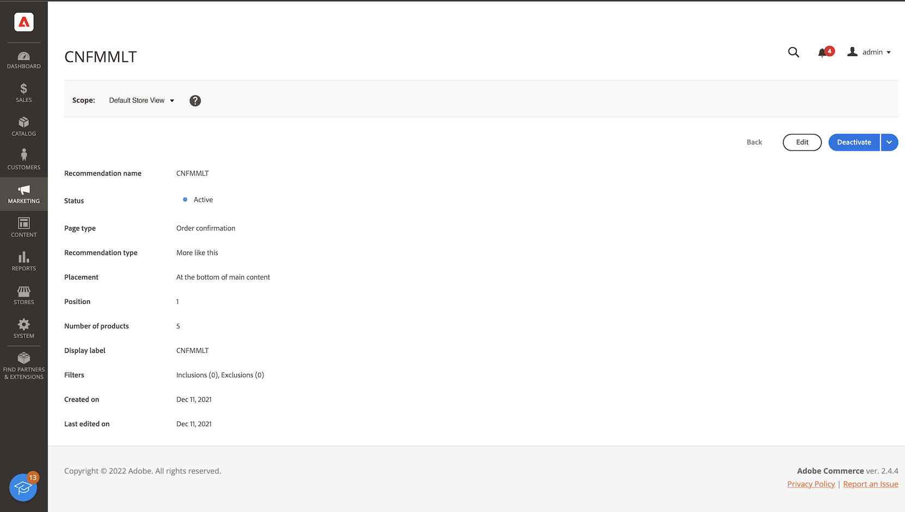

# 작업 공간

다음 [!DNL Product Recommendations] workspace에는 각 권장 사항의 성공을 추적하는 데 도움이 되는 지표와 함께 이전에 구성된 권장 사항 목록이 표시됩니다. 지난 일, 주 또는 월에 대한 지표를 계산하도록 목록을 구성할 수 있습니다. 지표를 사용하여 권장 사항 단위를 보거나 클릭한 빈도를 기반으로 실행 가능한 통찰력을 만들거나 권장 사항 수행 빈도를 분석할 수 있습니다.

_Recommendations 작업 공간_

## 범위 설정

처음에는 [범위](https://docs.magento.com/user-guide/stores/websites-stores-views.html) 모든 권장 사항 설정이에 대해 `Default Store View`. 상거래 설치에 여러 저장소 보기가 포함된 경우 **범위** 변환 후 [저장소 보기](https://docs.magento.com/user-guide/configuration/scope.html) 권장 사항이 적용되는 위치.

## 지표 날짜 범위 설정

1. 을(를) 클릭합니다. **달력**  제어.

1. 다음 중 하나를 선택합니다.

   - 최근 24시간
   - 최근 7일
   - 최근 30일

   지표 열의 계산된 값이 현재 날짜 범위를 반영하도록 변경됩니다.

## 열 표시/숨기기

1. 왼쪽 위 모서리에서 **표시/숨기기**  열.

   보이는 열에는 파란색 확인 표시가 나타납니다.

1. 메뉴에서 다음 중 하나를 수행합니다.

   - 숨겨진 열을 표시하려면 확인 표시 없이 열 이름을 클릭합니다.
   - 보이는 열을 숨기려면 확인 표시가 있는 열 이름을 클릭합니다.

   선택한 열만 포함하도록 테이블을 새로 고칩니다.

   
   _열 표시/숨기기_

## 설정

설정은 권장 사항 행동 데이터를 제공하는 SaaS 데이터 공간을 결정합니다.

- 권장 사항 행동 데이터가 생성되는 위치를 변경하려면 다른 SaaS 데이터 공간을 선택하십시오.

- 새 SaaS 데이터 공간을 구성하려면 **구성 편집**. 자세한 내용은 [설정](settings.md).

_Recommendations 설정_

## 세부 사항 보기

1. 테이블에서 검사할 권장 사항을 클릭합니다.

   
   _홈 페이지 전환율 세부 정보_

1. 권장 사항 상태를 변경하려면 **활성화** 또는 **비활성화**.

## 권장 사항 편집

권장 사항 세부 사항 페이지에서 **편집**. 자세한 내용을 보려면 [Recommendations 편집](edit.md).

## 권장 사항 만들기

권장 사항 세부 사항 페이지에서 **만들기**. 자세한 내용을 보려면 [Recommendations 만들기](create.md).

## 작업 공간 컨트롤

| 제어 | 설명 |
|---|---|
|  | 지표 계산에 사용되는 시간 범위를 결정합니다. 옵션: 24시간 / 7일 / 30일 |
|  | 에 나타나는 열을 결정합니다 [!DNL Product Recommendations] 테이블. |
| 설정 | 권장 사항-행동 데이터를 가져오는 SaaS 데이터 공간을 확인하고 시각적 유사성 권장 사항 유형을 활성화합니다. |
| 권장 사항 만들기 | 를 엽니다. [새 권장 사항 만들기](create.md) 페이지. |

## 열 설명

| 열 | 설명 |
|---|---|
| 이름 | 권장 사항의 이름입니다. |
| 페이지 | 권장 사항이 나타나는 페이지입니다. |
| 유형 | 권장 사항 유형입니다. |
| 상태 | 권장 사항 상태. 옵션: 비활성/활성/초안 |
| 생성됨 | 권장 사항을 만든 날짜입니다. |
| 마지막 편집 | 권장 사항을 마지막으로 편집한 날짜입니다. |
| 노출 횟수 | 페이지에서 권장 사항 단위가 로드되고 렌더링되는 횟수입니다. 브라우저 뷰포트의 접힌 부분 아래에 있는 권장 사항 단위가 페이지에 렌더링되지만 쇼퍼가 볼 수 없습니다. 이 경우, 렌더링된 단위는 노출으로 계산되지만, 뷰는 사용자가 단위를 보기 위해 스크롤하는 경우에만 계산됩니다. |
| vImpressions | (볼 수 있음 노출 횟수) 하나 이상의 보기를 등록하는 권장 사항 단위 수입니다. |
| 보기 횟수 | 구매자 브라우저의 뷰포트에 표시되는 권장 사항 단위 수입니다. 이 이벤트는 한 페이지에서 여러 번 실행할 수 있습니다. |
| 클릭 수 | 쇼핑객이 권장 사항 단위의 항목을 클릭한 횟수와 쇼핑객이 를 클릭하는 횟수의 합계입니다 **장바구니에 추가** 추천 단위의 단추 |
| 매출 | 현재 시간 범위에 대한 권장 사항에 의해 파생되는 수익입니다. |
| 매출 증대 | (라이프타임 매출) 추천에 의해 파생되는 라이프타임 수입입니다. |
| 뷰가능 | 보기에 등록하는 권장 사항 단위의 백분율입니다. |
| Ctr | (클릭스루 비율) 클릭을 등록하는 추천의 단위 노출 비율입니다. |
| vCtr | (볼 수 있는 클릭스루 비율) 클릭을 등록하는 권장 사항 단위에 대한 볼 수 있는 노출 횟수입니다. |
