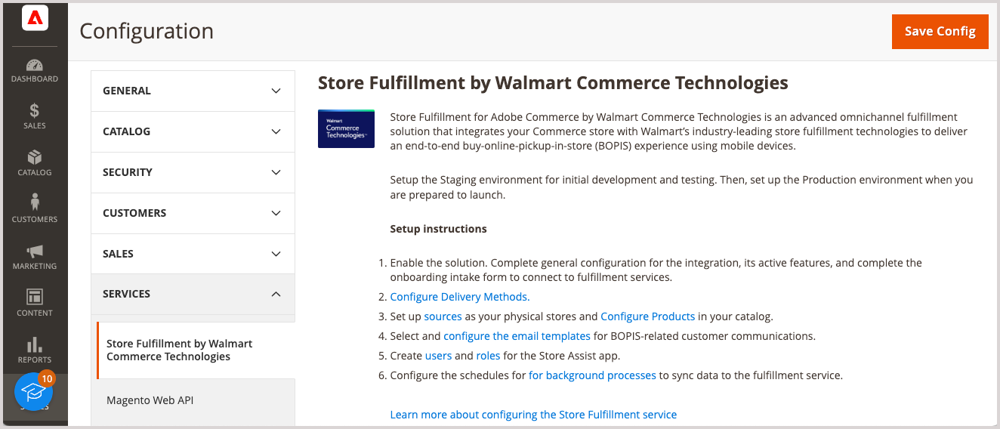

# 소개 [!DNL Store Fulfillment]

Store Fulfillment for Adobe Commerce by Walmart Commerce Technologies는 다음과 통합되는 고급 옴니채널 처리 솔루션입니다. [!DNL Commerce] 스토어를 통해 온라인으로 우수한 구매를 처리하고 스토어에서 픽업(BOPIS) 고객 경험을 제공합니다.

또한 스토어 이행 은 판매자가 비용을 절감하는 동시에 전환율, 평균 주문 가격 및 고객 만족도를 높일 수 있는 종합적인 이행 워크플로를 제공합니다. 이 워크플로우는 다음을 제공합니다.

* **옴니채널 유연성**- 상점과 창고를 픽업 포인트와 주문 처리 센터로 전환합니다.

* **편리한 고객 픽업 옵션**&#x200B;온라인 구매를 선택하는 동안, 고객들은 쉽게 제품을 구매할 수 있고 매장 내 또는 매장 내 픽업 중 하나를 선택할 수 있습니다.

* **이행 효율성**—Store Assist 모바일 애플리케이션을 사용하면 스토어 관계자의 주문 처리 속도와 정확도를 높일 수 있습니다.

* **모바일 편의성**- 고객은 모든 단계에서 주문 알림을 받습니다. 주문 확인부터 주문 픽업까지, 주문 상태를 추적하여 체크인 지시를 받을 수 있으며 매장 직원이 매장에 도착하면 매장 직원들과 소통할 수 있습니다.

* **운영 가시성**—저장소 수준의 재고 할당을 개선하여 적시에 로컬 이행 작업을 수행할 수 있습니다.

## 스토어 이행 확장

스토어 이행 솔루션은 기본 Adobe Commerce 기능을 지원하고 향상시킵니다.

* 구성, 그룹화, 번들 및 가상 등 대부분의 제품 유형 지원

* 와 통합 [[!DNL Adobe Commerce] Inventory management](https://docs.magento.com/user-guide/catalog/inventory-learn-more.html)

* ERP, OMS, WMS와 같은 POS(Point of Sale) 판매업체 재고 관리 시스템과 통합

* Luma 테마와 완벽하게 호환

* PWA 및 헤드리스 스토어프론트와의 부분적 호환성

* 는 Walmart Commerce Technologies의 스토어 지원 앱을 지원합니다. 이 앱은 픽업 주문 정보를 선택한 스토어 위치에 있는 직원의 핸드헬드 장치로 직접 전달합니다. 이러한 정보를 통해 고객이 매장에 도착하면 빠르고 정확하게 물건을 고르고, 스테이징하고, 고객에게 물건을 전달할 수 있다.

## 스토어 지원 앱

iOS 및 Android 디바이스용 스토어 지원 앱은 과 상호 작용합니다. [!DNL Walmart Commerce Technologies] 소매 상점에 옴니채널 처리 기능을 제공합니다.

* 동료의 모바일 장치를 저장하기 위해 매장 내 및 매장 내 픽업 주문 직접 보내기

* 고객이 주문 픽업을 위해 매장에 도착할 때 신속하고 정확하게 매장 주문을 수령, 스테이징하고 고객에게 전달하는지 확인합니다.

* 보안 정책, 2단계 인증 등을 포함하여 저장소 연결 사용자 액세스 관리

* 소매 저장소 위치 및 인벤토리에 대한 데이터를 Adobe Commerce에 자동으로 동기화

## 향상된 사용자 경험

스토어 이행 은 향상된 쇼핑 경험과 간소화된 이행 워크플로우를 제공하는 기능을 추가하여 Adobe Commerce을 향상시킵니다.

* **SLS(저장소 위치 선택기)**- 기본 체크아웃 외에도 제품 및 장바구니 페이지에 스토어 픽업 옵션, 인벤토리 가용성 및 스토어 선택기를 추가합니다.

* **재고 가용성**- Adobe Commerce Inventory management에 추가 제품 및 글로벌 구성 옵션을 추가합니다. 이러한 옵션은 시기 적절한 로컬 이행을 유도하기 위해 저장소 수준 인벤토리 할당을 지원합니다.

* **장바구니 및 체크아웃 개선 사항**- 온라인 쇼핑 세션 중에 가장 빠른 픽업 시간, 위치 및 비용을 고객에게 전달합니다.

* **체크인 프로세스 흐름**- 고객 체크인 프로세스를 개선하고 매장 내 또는 매장 내 픽업 도착 시 매장 직원과의 상호 작용을 개선하기 위한 인터페이스를 추가합니다.

* **내 계정 내역**-를 확장합니다. [!DNL Commerce] 계정 내역 - 주문 내역의 단계를 표시합니다.

* **트랜잭션 이메일**-의 관리 기능 확장 [!UICONTROL Sales Emails] 온라인 구매를 위한 이메일 템플릿을 추가하려면 스토어 거래에서 선택합니다. 템플릿은 주문 픽업 프로세스 동안 고객과 스토어 파트너 간의 실시간 커뮤니케이션을 지원합니다.

* **유연한 이행**-확장 [!DNL Commerce] 이러한 시나리오를 지원하는 데 필요한 취소 및 대변 메모를 용이하게 하면서 미납 주문, 수량 감소 및 부분 주문 이행을 처리하는 시나리오를 지원하는 기능.

>[!TIP]
>
> 스토어 이행 솔루션에 대한 빠른 데모는 다음을 참조하십시오. [스토어 이행 개요](https://experienceleague.adobe.com/docs/commerce-learn/tutorials/orders/store-fulfillment.html) 다음에서 사용 가능 _Adobe Commerce 비디오 및 Tutorials_.

